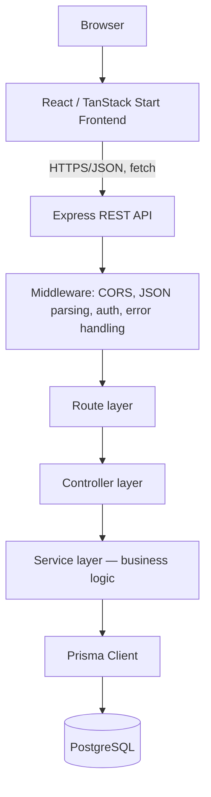
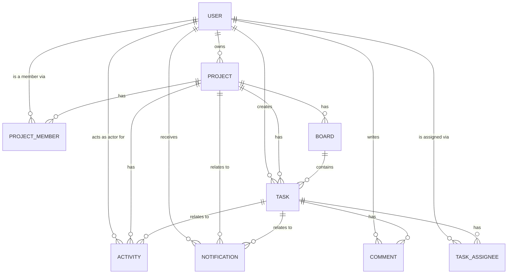
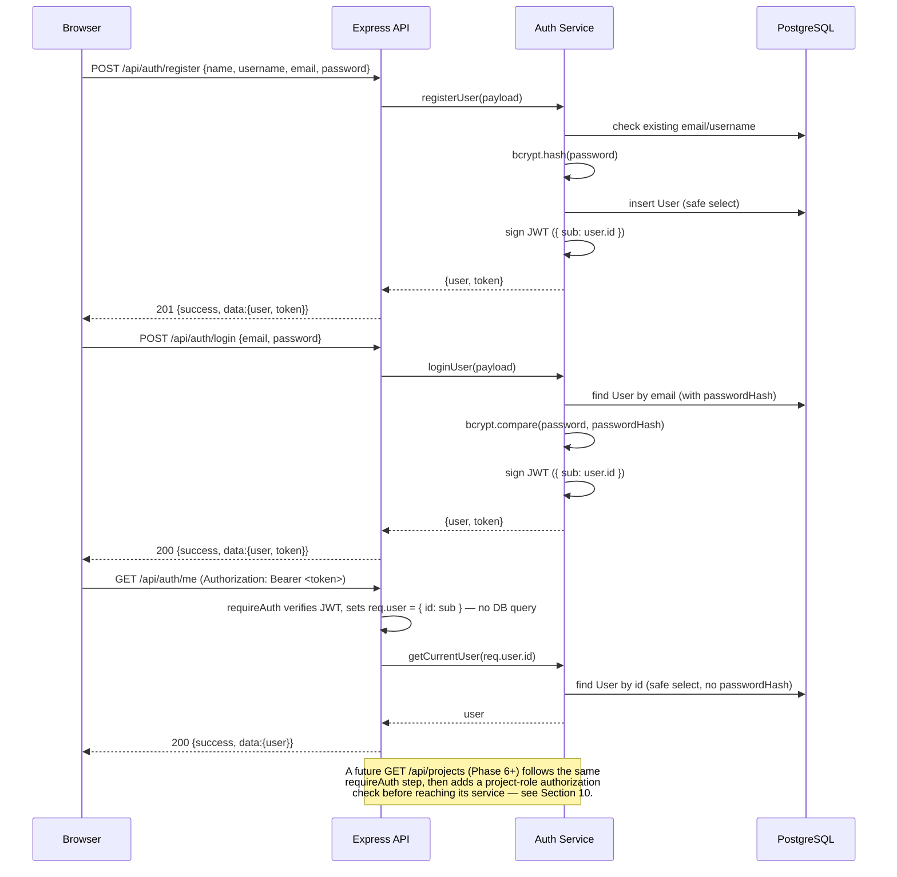
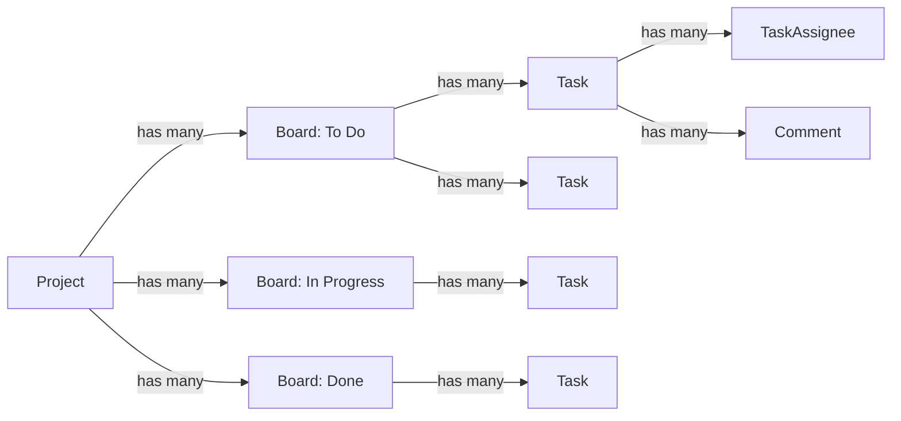
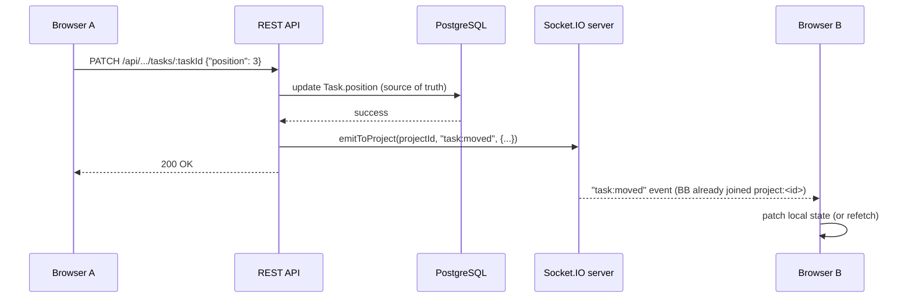

# TaskFlow — Architecture

CodeAlpha Full Stack Development Internship — Task 3

This document describes the planned and current architecture of TaskFlow, a
collaborative project-management application. It is written before
implementation begins (Phase 0) and is kept in sync as the project grows.

## 1. Project purpose

TaskFlow is a lightweight Trello/Asana-style project management tool. Users
create projects, invite members, organize work on boards, and track tasks
through comments, assignments, priorities, and due dates. It is built as a
portfolio-quality full-stack application, not a minimal CRUD demo.

## 2. CodeAlpha Task 3 requirements

The brief requires a project management tool supporting:

1. Users/authentication
2. Group projects
3. Project members
4. Task assignment
5. Task management
6. Comments/communication within tasks
7. Project boards
8. Task cards

Bonus scope: notifications and real-time updates. These core requirements
drive every schema and API decision below; bonus features are designed for,
but implemented last.

## 3. Functional scope

**In scope (current and future phases):**

- Registration, login, JWT-based sessions
- Profile management
- Creating projects and becoming a project owner
- Adding project members with roles (OWNER / ADMIN / MEMBER)
- Creating boards within a project
- Creating, moving, and prioritizing tasks
- Assigning tasks to one or more project members
- Commenting on tasks
- Project activity timeline
- Notifications (bonus)
- Real-time updates via Socket.IO (bonus)

**Out of scope:** deployment, third-party auth providers, file uploads,
mobile apps, external backend services (Supabase/Firebase/Mongo are
explicitly excluded — this project uses PostgreSQL + Prisma only).

## 4. Technology stack

| Layer | Technology |
|---|---|
| Frontend | React, TypeScript, TanStack Start, TanStack Router, Vite, Tailwind CSS |
| Backend | Node.js, Express.js (REST API), JavaScript |
| Database | PostgreSQL, Prisma ORM |
| Auth | JWT, bcryptjs |
| Real-time (bonus, later) | Socket.IO |
| Dev tooling | npm workspaces, Docker Compose (local Postgres only), Git |

## 5. High-level architecture



The service layer is the only layer allowed to call Prisma directly.
Controllers translate HTTP ↔ service calls; they never contain business
logic or raw queries. This keeps route handlers thin and testable and keeps
persistence details out of the HTTP layer.

## 6. Frontend architecture

**Implemented (Phases 13-15) — see [FRONTEND.md](./FRONTEND.md) for full
detail.**

- **TanStack Start + TanStack Router** for file-based routing and SSR-capable
  React rendering (mirrors the pattern already used in Task2).
- **Vite** as the dev server/bundler.
- **Tailwind CSS** for styling, plus a small hand-written component layer
  (`components/ui/`) — no third-party UI framework was introduced.
- **Socket.IO client** (`socket.io-client`), the one new dependency added in
  this phase, connecting with the same JWT the REST API already uses.
- Actual structure:
  - `src/routes/` — file-based routes: public (`/`, `/login`, `/register`)
    plus a pathless `_authenticated/` layout (auth-guarded, wraps `AppShell`)
    holding `/app/dashboard`, `/app/projects/*`, `/profile`, `/settings`
  - `src/components/ui/` — design-system primitives (Button, FormField,
    Modal, ConfirmDialog, Card, Badge, Avatar, Feedback states, toasts)
  - `src/components/layout/`, `components/projects/`, `components/tasks/`,
    `components/comments/` — feature components grouped by domain
  - `src/lib/api/` — one typed module per backend resource
    (`authApi`/`usersApi`/`projectsApi`/`boardsApi`/`tasksApi`/
    `assigneesApi`/`commentsApi`/`notificationsApi`), all funneled through
    one `client.ts` request/error-normalization layer
  - `src/auth/` — `AuthContext` (login/register/logout/session-restore) +
    `tokenStorage` (an isolated `localStorage` wrapper)
  - `src/realtime/` — `SocketContext` (connection, project rooms,
    `useSocketEvent` hook)
  - `src/hooks/` — one data/mutation hook per feature area (`useProjects`,
    `useProject`, `useKanban`, `useComments`, `useNotifications`), each
    reconciling its own REST state with the matching realtime events
  - `src/styles/` — global Tailwind entry point + the design system's token
    layer (focus ring, toast/skeleton animation)
  - `client/e2e/` — Playwright browser tests (flows + responsive checks)
- The frontend never hardcodes application/demo data. All content is fetched
  from the REST API, which is in turn backed by the database seed system —
  verified directly: every list/detail screen renders an honest empty state
  rather than a fabricated one when the backend has nothing to show.
- Shared state (current user/session, Socket.IO connection, toasts) lives in
  React context (`AuthContext`, `SocketContext`, `ToastContext`) — no
  external state-management or data-fetching library was introduced; see
  [FRONTEND.md](./FRONTEND.md#state-management-approach) for why that was a
  deliberate choice given this app's actual size.
- **The backend has no `status` field on `Task` and no cross-board move
  endpoint** — a `Board` *is* this app's Kanban column. The frontend's
  Kanban board reflects that directly rather than inventing a `status`
  concept the API doesn't have; see
  [FRONTEND.md](./FRONTEND.md#kanban--board-is-the-column-important).

## 7. Backend architecture

Layered Express application:

```
routes/      → maps HTTP verb + path to a controller function
controllers/ → parses req, calls a service, shapes the HTTP response
services/    → business logic, calls Prisma, enforces domain rules
validators/  → request payload validation (checked before controllers act)
middleware/  → cross-cutting concerns: CORS, auth, error handling, 404
config/      → environment loading, Prisma client singleton
utils/       → stateless helpers (password hashing, JWT signing, etc.)
```

`app.js` wires middleware and routers together; `server.js` is the only file
that binds a port and owns process lifecycle (including graceful shutdown).
This split allows the Express app to be imported by tests without starting a
real network listener.

## 8. Database architecture

PostgreSQL is the single source of truth for all application state,
accessed exclusively through Prisma Client from the service layer. See
[DATABASE_SCHEMA.md](./DATABASE_SCHEMA.md) for full model-by-model detail.



## 9. Authentication architecture

**Implemented in Phase 4.** Full detail — including the exact validation
rules, the login-timing consideration, and per-scenario security notes —
lives in [AUTHENTICATION.md](./AUTHENTICATION.md); this section stays at
the architectural level.

- Register: validate input (`server/src/validators/auth.validator.js`),
  bcrypt-hash the password (`bcryptjs`, cost factor 12 —
  `server/src/utils/password.js`), create a `User` row, return a signed JWT.
  A duplicate email/username is a `409`, resolved both by a pre-check and by
  catching Prisma's `P2002` on the insert (closing the race between the two).
- Login: look up by email (selecting `passwordHash` only for this one
  query), `bcrypt.compare`, return a signed JWT. A nonexistent email and a
  wrong password produce the exact same `401` — see
  [AUTHENTICATION.md](./AUTHENTICATION.md#login-flow) for why, including the
  dummy-hash timing consideration.
- JWT payload: `{ sub: userId }` plus the standard `iat`/`exp` — nothing
  else — signed with `JWT_SECRET`, expiring per `JWT_EXPIRES_IN`
  (`server/src/utils/jwt.js`).
- Token transport: `Authorization: Bearer <token>` header, checked by
  `requireAuth` (`server/src/middleware/auth.middleware.js`). This
  middleware establishes *authentication* only (the token's signature proves
  who the caller is) — it does not query the database; anything needing
  fresher user data or *authorization* looks it up itself from `req.user.id`.
- `passwordHash` is never selected into an API response. Two distinct Prisma
  `select` objects exist for this reason: one includes `passwordHash` for
  the login comparison only, the other never selects it at all (used by
  registration and `/me`) — the safe-vs-unsafe boundary is enforced at the
  query itself, not left to a serializer to remember.
- A dedicated `toSafeUser()` serializer (`server/src/utils/user.js`) allow-lists
  exactly the fields an API response may contain, used identically by
  register, login, and `/me` — never a raw spread of a Prisma row.



## 10. Authorization architecture

**Implemented in Phase 6.** Role-based, scoped to a project via
`ProjectMember.role`. Full detail — every endpoint, every rule, the
complete test matrix — lives in [PROJECTS.md](./PROJECTS.md); this section
stays at the architectural level.

- **OWNER** — full control: rename project, manage members and roles,
  delete the project. Exactly one per project, set at creation and never
  reassigned by any endpoint in this phase.
- **ADMIN** — update project details, add/remove members (never the
  owner), cannot delete the project or change anyone's role.
- **MEMBER** — a project participant with no management privileges over
  the project or its membership (task-level permissions arrive with
  Phase 7+, once tasks exist).

The `requireAuth` middleware (Section 9) verifies the JWT and attaches
`req.user = { id }`. Two new middleware, run in sequence after it
(`server/src/middleware/projectAuth.middleware.js`):

- **`requireProjectMember()`** — looks up the caller's `ProjectMember` row
  for `:projectId` from PostgreSQL and attaches
  `req.projectMembership = { projectId, role }`. Distinguishes a project
  that doesn't exist (`404`) from one that exists but the caller isn't in
  (`403`) — a non-member learns nothing beyond what a generic 404 already
  tells anyone, but a genuinely missing project isn't reported as if it
  existed and merely excluded them.
- **`requireProjectRole(...allowedRoles)`** — checks the already-looked-up
  role against an explicit allow-list, e.g. `requireProjectRole('OWNER', 'ADMIN')`.
  An allow-list rather than a single `minRole` threshold, since only two
  combinations are ever actually used (`['OWNER']` and
  `['OWNER', 'ADMIN']`) — encoding a full role ordering/hierarchy for that
  would be more machinery than the two real cases justify.

Neither middleware ever reads a role from the request body, a query
parameter, or the JWT payload (which, per Section 9, only ever contains
`sub`) — the role is always the one just read from `ProjectMember` in the
same request.

Ownership itself is tracked in exactly one authoritative place per project
at any time: the `ProjectMember` row with `role = OWNER`. `Project.ownerId`
is set to match at creation (in the same transaction) and is never
independently mutated afterward — `PATCH /api/projects/:id` only accepts
`name`/`description`, and no endpoint changes who owns a project — so the
two never have a chance to drift apart. Authorization checks read
`ProjectMember.role` (that's what a request is actually asking
"about this project, as this membership"), not a separate `ownerId`
comparison, since maintaining two authoritative sources for the same fact
would only create a place for them to disagree.

## 11. Project membership model

- `Project.ownerId` is the single source of truth for who owns a project.
- Every project also has a corresponding `ProjectMember` row for its owner
  (`role = OWNER`), so membership listings/queries never need a special
  case for "is this the owner." **Implemented in Phase 6:**
  `project.service.js`'s `createProject` creates both rows in one
  `prisma.$transaction` — a project can never exist without its owner
  membership, even if the process crashes mid-request.
- `(projectId, userId)` is a composite primary key on `ProjectMember`,
  guaranteeing a user cannot join the same project twice — Phase 6's
  `addMember` relies on this constraint directly (catching Prisma's
  `P2002` and converting it to a `409`) rather than a separate
  check-then-insert race.
- The OWNER's `ProjectMember` row is structurally protected: neither
  `removeMember` nor `changeMemberRole` (Phase 6) will act on a row whose
  role is `OWNER`, regardless of who is calling — the only way to stop
  being a project's owner is to delete the project itself.

## 12. Board/task relationship

**Board CRUD implemented in Phase 7** (`GET/POST/PATCH/DELETE`
under `/api/projects/:projectId/boards` — see [BOARDS.md](./BOARDS.md)).
**Task CRUD implemented in Phase 8** (`GET/POST/PATCH/DELETE` under
`/api/projects/:projectId/boards/:boardId/tasks` — see
[TASKS.md](./TASKS.md)). **Task assignment implemented in Phase 9** (see
Section 13 and [ASSIGNMENTS.md](./ASSIGNMENTS.md)). Comments,
notifications, and Socket.IO remain Phases 10–12.

- A `Project` has many `Board`s (e.g. "To Do", "In Progress", "Review",
  "Done" — names are per-project data, not hardcoded enum values, so
  projects can define their own workflow).
- A `Board` has many `Task`s. A `Task` also carries its own `projectId` so
  project-scoped task queries never require a join through `Board` — this
  is intentional denormalization for query simplicity and safe indexing.
- `position` (integer) on both `Board` and `Task` gives deterministic,
  drag-and-drop-friendly ordering without reordering every row on every
  move (later phase can use fractional/gap-based positions if needed). Both
  board creation (Phase 7) and task creation (Phase 8) auto-assign the next
  position when one isn't supplied (`MAX(position) + 1` scoped to the
  parent — project for boards, board for tasks — or `0` for the first row)
  — no drag-and-drop renumbering algorithm yet, just enough ordering to be
  deterministic and to not require the frontend to compute a position.
- **No board ID is ever reachable through the wrong project's URL, and no
  task ID is ever reachable through the wrong board's (or project's)
  URL.** Every board read/write checks both that the board exists *and*
  that `board.projectId` matches the request's `:projectId`; every task
  read/write checks both that the task exists *and* that `task.boardId`
  matches the request's `:boardId` (which `requireBoardInProject` has
  already confirmed belongs to the request's `:projectId`). In both cases
  a resource from the wrong parent produces the identical `404` a
  genuinely nonexistent one would, never a `403` or any other
  distinguishing detail.
- **Deleting a board cascades to its tasks** (`Task.board` is
  `onDelete: Cascade` — see [DATABASE_SCHEMA.md](./DATABASE_SCHEMA.md)).
  As of Phase 8, tasks can exist, so this cascade is no longer inert — it
  was verified directly in this phase (deleting a board with tasks under
  it leaves zero orphaned `tasks` rows).
- **The `Task` model has no `status` field or enum.** A task's workflow
  stage is represented by which `Board` it's on — the same free-text,
  per-project boards described above. Phase 8's validator explicitly
  recognizes a `status` field in a request body and rejects it with a
  message pointing at board placement instead of a generic "unsupported
  field" — see [Important design decisions](#24-important-design-decisions)
  for the full reasoning.



## 13. Task assignment model

**Implemented in Phase 9** (`POST/GET/DELETE` under
`/api/projects/:projectId/boards/:boardId/tasks/:taskId/assignees` — see
[ASSIGNMENTS.md](./ASSIGNMENTS.md)). The task card itself (title,
description, priority, position, due date) was Phase 8.

- `TaskAssignee` is a join table between `Task` and `User`, with a composite
  primary key `(taskId, userId)` — a task can have zero or more assignees,
  and a user cannot be assigned to the same task twice (enforced by the
  primary key itself, not just an application-level pre-check — a
  duplicate `POST` maps Prisma's `P2002` to a `409`).
- **The business rule anticipated since Phase 2 is now enforced:** an
  assignee must already be a `ProjectMember` of the task's project. Prisma
  cannot express this cross-table constraint declaratively (`TaskAssignee`
  and `ProjectMember` share no foreign key), so `assignment.service.js`
  checks it explicitly — target user exists, then target user has a
  `ProjectMember` row for this exact `projectId` — before the
  `TaskAssignee` row is ever created. Verified directly against the
  database after implementation: zero `TaskAssignee` rows anywhere in the
  database (new or pre-existing seed data) reference a user who isn't a
  member of that task's project.
- Removing an assignment (`DELETE .../assignees/:userId`) deletes only the
  `TaskAssignee` row — the `User`, `ProjectMember`, and `Task` are
  untouched, since `TaskAssignee` is a pure join row with no children of
  its own to cascade.

## 14. Comment model

**Implemented in Phase 10** (`GET/POST/PATCH/DELETE` under
`/api/projects/:projectId/boards/:boardId/tasks/:taskId/comments` — see
[COMMENTS.md](./COMMENTS.md)).

- A `Comment` belongs to exactly one `Task` and has exactly one `author`
  (`User`). Comments are the primary communication channel on a task.
- Comments are ordered by `createdAt` (indexed as `(taskId, createdAt)` for
  efficient "load a task's comment thread" queries) — ascending, the
  natural reading order for a conversation, unlike every other list in this
  project (which orders newest-first).
- Editing a comment updates `updatedAt`, but is restricted to the comment's
  own `author` — not `OWNER`/`ADMIN`, a deliberate exception to this
  project's usual "elevated roles manage everything" pattern (see Section
  24). Deletion is the opposite: author *or* `OWNER`/`ADMIN` (moderation).
- `authorId` is always `req.user.id` from the verified JWT — never a
  request body field, so a comment can never be authored as someone else.

## 15. Notification architecture

**Implemented in Phase 11** (`GET/PATCH/DELETE` under `/api/notifications`
— see [NOTIFICATIONS.md](./NOTIFICATIONS.md)).

- A `Notification` always has a `userId` (recipient) and a `type`
  (`NotificationType` enum) plus a human-readable `message`.
- `projectId`/`taskId` are optional context pointers, cascading with their
  target so a notification never dangles after its subject is deleted.
- Notifications are created by the service layer as a side effect of
  domain actions (assigning a task, commenting, moving/updating a task,
  adding a member) — never created directly by a controller, and never for
  an operation that didn't actually commit. `notification.service.js`
  provides the generic create/list/read/delete primitives; each domain
  service (membership, task, assignment, comment) owns the business logic
  of *when* to call them and *who* the recipients are.
- Every trigger excludes the actor from their own notification — nobody is
  told about their own self-assignment, their own edit, or their own
  comment.
- REST endpoints: list my notifications (paginated, newest first), an
  unread count (one `COUNT` query), mark one or all read (idempotent), and
  delete one. Every route is scoped to `req.user.id`'s own rows; a
  notification belonging to someone else is a `404`, identical to one that
  doesn't exist.

## 16. Socket.IO architecture

**Implemented in Phase 12** (see [REALTIME.md](./REALTIME.md) for the
complete event list, room design, and authentication flow).

Real-time updates are additive, not a replacement for persistence. Every
state change is written to PostgreSQL first; Socket.IO only broadcasts that
a change happened so connected clients can refetch/patch their view.



Implemented conventions:

- One Socket.IO room per `projectId` (`project:<id>`); a socket sends
  `project:join { projectId }` and receives a `{ success, message? }`
  acknowledgement — membership is verified fresh from PostgreSQL on every
  join, exactly like `requireProjectMember` does for REST requests. Every
  authenticated socket also auto-joins a personal `user:<id>` room on
  connect, for notification delivery.
- Events are named `<entity>:<action>`
  (`project:member_added`; `board:created/updated/deleted`;
  `task:created/updated/moved/deleted`; `task:assigned/unassigned`;
  `comment:created/updated/deleted`; `notification:new`, `notification:read`).
- The socket server never accepts writes — it is emit-only from the
  server's perspective (`server/src/realtime/socket.js` exposes
  `emitToProject`/`emitToUser`, called by each domain service after its own
  Prisma write commits). Clients always write through the REST API; the
  only inbound socket events are `project:join`/`project:leave`.
- Socket auth reuses the same JWT (passed as `socket.handshake.auth.token`,
  verified with the identical `verifyAccessToken()` every REST request
  uses) rather than inventing a second auth mechanism.

## 17. API organization

REST, versioned implicitly under `/api` (no `/v1` yet — added later if a
breaking change is needed). Current + planned resource layout:

```
/api/health            GET                          — implemented (Phase 3)
/api/health/db         GET                          — implemented (Phase 3)
/api/auth              POST /register, POST /login, — implemented (Phase 4)
                       GET /me (requireAuth)
/api/users/search       GET (public)                 — implemented (Phase 5)
/api/users/me           GET, PATCH (requireAuth)     — implemented (Phase 5)
/api/users/:username    GET (public)                 — implemented (Phase 5)
/api/projects           GET, POST (requireAuth)              — implemented (Phase 6)
/api/projects/:id       GET, PATCH, DELETE (role-gated)       — implemented (Phase 6)
/api/projects/:id/members         GET, POST, PATCH, DELETE   — implemented (Phase 6)
/api/projects/:id/boards          GET, POST (any member)     — implemented (Phase 7)
/api/projects/:id/boards/:boardId GET (any member),          — implemented (Phase 7)
                                   PATCH/DELETE (OWNER/ADMIN)
/api/projects/:id/boards/:boardId/tasks           GET, POST (any member)          — implemented (Phase 8)
/api/projects/:id/boards/:boardId/tasks/:taskId   GET, PATCH (any member),        — implemented (Phase 8)
                                                   DELETE (OWNER/ADMIN)
/api/.../tasks/:taskId/assignees          GET (any member),         — implemented (Phase 9)
                                           POST (OWNER/ADMIN)
/api/.../tasks/:taskId/assignees/:userId  GET (any member),         — implemented (Phase 9)
                                           DELETE (OWNER/ADMIN)
/api/.../tasks/:taskId/comments            GET, POST (any member)   — implemented (Phase 10)
/api/.../tasks/:taskId/comments/:commentId GET (any member),        — implemented (Phase 10)
                                            PATCH (author only),
                                            DELETE (author or OWNER/ADMIN)
/api/notifications                    GET, GET /unread-count,       — implemented (Phase 11)
                                       PATCH /:id/read, PATCH /read-all,
                                       DELETE /:id (requireAuth, own rows only)
/api/projects/:id/activity           GET
```

Each resource group gets its own `routes/*.routes.js`, mounted from a single
`routes/index.js`, matching the Task2 convention. `project.routes.js`
(Phase 6) holds both the project CRUD routes and the nested
`/:projectId/members/*` routes in one file rather than a separate nested
router — the membership routes need `:projectId` from the parent path
anyway, and there's no `/:username`-vs-`/search`-style static/dynamic
ordering hazard here (`/:projectId` and `/:projectId/members` differ by
path depth, not by competing for the same segment), so splitting them into
two files would add indirection without solving an actual problem.

Boards (Phase 7) get their own `board.routes.js` rather than growing
`project.routes.js` further — a real `Router({ mergeParams: true })` mounted
at `router.use('/:projectId/boards', requireProjectMember(), boardRoutes)`,
so it inherits `:projectId` from the parent path and the membership check
from the mount point, and only adds its own `requireProjectRole` where a
specific board operation needs it. This is also a deliberate change from
this document's original Phase 0 sketch of a top-level `/api/boards/:id` —
keeping boards fully nested under their project (`/api/projects/:id/boards/:boardId`)
made the cross-project isolation check (Section 12) a natural, unavoidable
part of every lookup, rather than a separate rule to remember for a
route that could otherwise be reached without ever mentioning its project.

Tasks (Phase 8) follow the identical pattern one level deeper: their own
`task.routes.js`, `Router({ mergeParams: true })`, mounted from
`board.routes.js` at `router.use('/:boardId/tasks', requireBoardInProject(), taskRoutes)`.
`requireBoardInProject` (`server/src/middleware/boardAuth.middleware.js`)
is new, but it doesn't duplicate board.service.js's own hierarchy check —
it calls that function's exported `getBoardWithinProject` directly, so
there is exactly one implementation of "does this board belong to this
project," reused by both board.controller.js's direct board operations and
every nested task route's baseline gate.

Assignees (Phase 9) go one level deeper still: `assignment.routes.js`,
mounted from `task.routes.js` at
`router.use('/:taskId/assignees', requireTaskInBoard(), assignmentRoutes)`.
`requireTaskInBoard` (`server/src/middleware/taskAuth.middleware.js`)
reuses task.service.js's exported `getTaskWithinBoard` the same way
`requireBoardInProject` reuses `getBoardWithinProject` — one implementation
per hierarchy level, each reused by both its own resource's controller and
whatever's nested underneath it.

Comments (Phase 10) are a *sibling* of assignees, not a child of them —
`comment.routes.js` is mounted directly from `task.routes.js` at
`router.use('/:taskId/comments', requireTaskInBoard(), commentRoutes)`,
reusing the exact same hierarchy gate. Comments have no route-level role
gate at all (unlike boards/tasks/assignees' `requireProjectRole` on their
write operations) — author-vs-moderator authorization depends on the
specific comment's `authorId`, which no fixed role check can know in
advance, so it's resolved inside `comment.service.js` itself once the
comment has actually been looked up.

Notifications (Phase 11) break this nesting pattern entirely and are
mounted directly from `routes/index.js`, like `/auth` and `/users` — they
are user-scoped, not project/board/task-scoped, so there is no project
hierarchy to verify; `requireAuth` alone is the only gate, and every
service function additionally scopes its query to `req.user.id`.

`/api/auth/me` and `/api/users/me` are deliberately separate, not
duplicates: the former is read-only "who am I" identity data returned as
part of the auth module (Phase 4) and exists mainly so a freshly-issued
token can be confirmed against the server; the latter (Phase 5) is the
actual profile — the same data plus PATCH support — served from its own
module so the auth module still has no reason to know about profile
business logic (validation rules, username-uniqueness handling) that isn't
its concern. See [USER_PROFILES.md](./USER_PROFILES.md) for the full detail.

## 18. Error-handling strategy

**Implemented in Phase 3.** A small `AppError` class
(`server/src/utils/AppError.js` — `message`, `statusCode`, `code`) is how
services/controllers signal a deliberate, expected failure (a dependency
that's down, a not-found record, a conflict). It is deliberately not a
framework: one class, no subclass hierarchy.

The centralized `errorHandler` middleware (`server/src/middleware/errorHandler.js`)
resolves any thrown value in this order:

1. `AppError` — trusted as-is (its whole point is a safe, chosen message).
2. Malformed JSON (`express.json()`'s `entity.parse.failed`) → 400.
3. Oversized body (`entity.too.large`) → 413.
4. Known Prisma errors — `PrismaClientKnownRequestError` `P2002` (unique
   conflict) → 409, `P2025` (record missing) → 404, anything else known →
   400; `PrismaClientValidationError` → 400.
5. A plain `Error` with an explicit non-500 `.status`/`.statusCode` (e.g. the
   health service's 503) — trusted, since deliberate application code set
   it. An explicit 500 is **not** trusted this way, only `AppError` may
   speak for a 500 — an ordinary bug can also happen to have
   `.statusCode === 500` sitting on it, and that must not leak its message.
6. Anything else → generic 500, `"Something went wrong"`. Full error detail
   (including stack) is logged server-side via `console.error` for every
   5xx, in every environment — but the response body never contains a
   stack trace, regardless of `NODE_ENV`.

Every error response has the same shape: `{ success: false, message, code? }`.
Every success response is `{ success: true, message }` (health endpoints) or
`{ success: true, data }` (future resource endpoints) — established now so
later controllers have one convention to follow.

Controllers never `try/catch` business errors themselves beyond passing them
to `next(error)` — and as of Express 5 (used here), an `async` route handler
that throws or rejects is forwarded to `next(error)` automatically, so no
`asyncHandler` wrapper is needed (verified directly against the installed
Express version; see Phase 3 verification notes in the project history).

A `notFoundHandler` catches any unmatched route under `/api` and returns
`{ success: false, message: "Route not found", code: "NOT_FOUND" }` — JSON,
never an HTML error page.

## 19. Validation strategy

- Request payloads are validated in a `validators/` layer before reaching
  controllers, checked as Express middleware on the relevant routes (later
  phase — Phase 1/2 only need the folder to exist as a foundation).
- Validation failures short-circuit with a 400 and a descriptive message;
  they never reach the service layer.
- Prisma's own schema constraints (unique, required, foreign key, enum) are
  the last line of defense, not the primary validation mechanism.

## 20. Security strategy

**Implemented in Phase 3:**

- `helmet()` sets the standard set of safe HTTP headers (`X-Content-Type-Options`,
  hides `X-Powered-By`, etc.). Its default cross-origin-resource-policy
  (`same-origin`) is deliberately relaxed to `cross-origin` — this API is
  designed to be called from a different origin/port (the Vite frontend),
  and the default would otherwise cause browsers to block the frontend's own
  legitimate `fetch()` calls even though CORS allows them. This is the one
  documented deviation from helmet's defaults, and it only affects who may
  *read a response*, not who may write one — it does not weaken CORS itself.
- CORS restricted to the exact string in `CLIENT_URL` (never `*`, never an
  origin-reflecting function) — a mismatched `Origin` still gets a response,
  but with an `Access-Control-Allow-Origin` that doesn't match its own
  origin, which is what makes browsers refuse to expose it to that page's
  JavaScript. `credentials` is intentionally left off, since nothing sends
  cookies yet — enabling it "just in case" would only widen what a
  misconfigured origin could do, for no current benefit.
- `express.json()` body size capped at 100kb — comfortably larger than any
  request this phase's endpoints take, small enough to make a trivial
  payload-flood pointless.
- Environment validation fails startup immediately in production if
  `DATABASE_URL`, `JWT_SECRET`, or `CLIENT_URL` is missing, rather than
  failing confusingly later on first use.
- Nothing is ever logged that could leak a secret: the dev-only request
  logger records method/path/status/duration only (never headers or body),
  and error logging never includes `DATABASE_URL`, `JWT_SECRET`, or request
  bodies.
- Postgres bound to `127.0.0.1` only in Docker Compose — never exposed on
  the network.
- `.env` files are git-ignored; only `.env.example` (placeholders) is
  committed.

**Implemented in Phase 4:**

- Passwords hashed with bcryptjs (cost 12); `passwordHash` is selected from
  the database only for the login comparison and is never serialized into
  any API response (enforced by two separate Prisma `select` shapes, plus
  an allow-list serializer — see Section 9).
- JWTs signed with `JWT_SECRET`, minimal payload (`sub` only), expire per
  `JWT_EXPIRES_IN`. Every failure mode of `requireAuth` (missing header,
  wrong scheme, empty/malformed/expired/tampered token, wrong signature)
  returns the identical generic `401` — none of them is distinguishable
  from the response.
- Login failure (nonexistent email vs. wrong password) is a single generic
  `401 "Invalid email or password"`, with a dummy bcrypt comparison run for
  a nonexistent email so response timing doesn't leak which case it was.
- Registration validation happens before any database or bcrypt work, and
  never reveals database internals in its error messages.

**Planned for later phases:**

- Authorization checks (project role, resource ownership) happen in the
  service layer, not just the UI, so the API is safe even if the frontend is
  bypassed. (Phase 4 established *authentication* only — see Section 10.)

## 21. Testing strategy

- **API verification:** manual `curl`/HTTP checks against `/api/health` and
  `/api/health/db`, plus the full Phase 3 foundation matrix — malformed
  JSON (400), oversized body (413), unknown route (404), allowed vs.
  arbitrary CORS origin, and a real database-down scenario (503, verified by
  stopping the Postgres container) — all confirmed against the running
  server. Automated request-level tests are added once there's enough
  surface area to justify a test runner as a dependency.
- **Phase 4 authentication verification:** the full register → login → `/me`
  sequence against real PostgreSQL; every validation rule (bad username
  shapes including the mixed-case case, bad email, short/over-length
  password, missing fields); duplicate email and duplicate username (409);
  wrong password and nonexistent email (both the identical generic 401);
  every `requireAuth` rejection path (no header, `Basic` scheme, empty
  `Bearer`, malformed token, tampered token, expired token, a token signed
  with a different secret); the decoded JWT payload (confirmed to contain
  only `sub`/`iat`/`exp`); a Phase 2 seed account logging in through the new
  endpoint with its original seed-time password hash; and a full regression
  of every Phase 3 behavior (health, 404, malformed JSON, oversized body,
  CORS). See [AUTHENTICATION.md](./AUTHENTICATION.md) for the complete
  scenario list and results.
- **Phase 5 user profile verification:** public profile lookup (existing
  seeded username, nonexistent username → 404, mixed-case URL segment
  resolving via lowercase normalization); `/me` GET with valid/missing/
  invalid tokens; every PATCH scenario (each field individually, multiple
  fields together, empty body → 400, every disallowed field — `email`,
  `password`, `passwordHash`, `id`, `createdAt` — → 400, invalid username
  shape → 400, duplicate username → 409, username-to-its-own-current-value
  → 200 no-op, oversized bio → 400, `javascript:`/`data:` avatar URLs →
  400, clearing `bio`/`avatarUrl` with `""` → `null`, unauthenticated PATCH
  → 401); search (case-insensitive match against username and name, `q`
  required, pagination metadata correct across two pages with zero
  overlapping rows, every invalid `page`/`limit`/`q` → 400); confirmed
  `passwordHash` absent from all three response types; confirmed the route
  order (`/search`, `/me` before `/:username`) via a diagnostic 401 vs. 404
  distinction; full regression of Phase 3 and Phase 4. See
  [USER_PROFILES.md](./USER_PROFILES.md) for the complete scenario list.
- **Phase 6 project & membership verification:** full project CRUD
  (create with invalid/unsupported input, list scoped to only the caller's
  own memberships, detail with the caller's role, partial update); the
  complete OWNER/ADMIN/MEMBER/non-member authorization matrix for update,
  delete, add-member, remove-member, and change-role — each tested from
  every role, not just the ones expected to succeed; duplicate membership
  (409), nonexistent target user (404), invalid/`OWNER` role in a
  membership request (400, rejected by validation before reaching the
  service); the owner-protection rules (cannot be removed, cannot have
  their role changed, by anyone, including themself); a genuinely missing
  project (404) vs. an existing one the caller isn't in (403), confirmed as
  distinguishable; two independently-owned projects confirmed fully
  isolated from each other (a member of one gets 403 on every operation
  against the other, including trying to add themself as a member); a real
  `DELETE` verified via direct SQL to leave zero orphaned `project_members`
  rows and zero duplicate `(projectId, userId)` pairs across the whole
  table; full regression of Phase 3, 4, and 5. See
  [PROJECTS.md](./PROJECTS.md) for the complete scenario list and results.
- **Phase 7 board verification:** unauthenticated requests rejected on all
  five endpoints; the full OWNER/ADMIN/MEMBER/non-member matrix for
  create (any member succeeds, non-member 403), update and delete
  (OWNER/ADMIN succeed, MEMBER and non-member 403); automatic position
  assignment across three sequential creates (0, 1, 2) with no
  `position` supplied; invalid/empty name and unsupported fields (`400`);
  invalid `position` — negative and non-integer — (`400`); list scoped to
  the requested project only, in deterministic `position` order; **the
  critical isolation check** — a board created under Project A returns
  the identical `404 BOARD_NOT_FOUND` when requested, updated, or deleted
  through Project B's URL, from a caller who is a legitimate member of
  Project B — confirming a valid board id from elsewhere is exactly as
  inaccessible as one that doesn't exist; nonexistent board and
  nonexistent project both `404`; a real delete verified via direct SQL to
  leave zero orphaned `boards` rows; full regression of Phase 3, 4, 5, and
  6. See [BOARDS.md](./BOARDS.md) for the complete scenario list and
  results.
- **Phase 8 task verification:** unauthenticated requests rejected on all
  five endpoints; OWNER/ADMIN/MEMBER can all create/list/view/update,
  non-member `403` on all four, nonexistent project/board both `404`;
  valid create (auto-`position` across two sequential creates), missing/
  empty title, invalid `priority`, invalid `position`, a `status` field
  (the explanatory message, not a generic rejection), and an unsupported
  field (`boardId`) — each `400` except the valid case; list scoped to the
  requested board only, ordered by `position`/`createdAt`/`id`, paginated;
  **the critical isolation check, exercised twice** — a task under Board
  A1 requested, updated, or deleted through Board A2's URL (same project)
  and through an entirely different project's board both return the
  identical `404 TASK_NOT_FOUND`, from callers who are legitimate members
  of the project/board actually being queried; any member can update
  content/priority/position/`dueDate`, non-member `403`, every invalid
  update field `400`, unsupported field (`createdById`) `400`; MEMBER
  `403` and non-member `403` on delete, OWNER and ADMIN both succeed,
  confirmed gone from a follow-up list, deleting an already-gone task
  `404`; direct SQL after all of the above confirmed zero orphaned `tasks`
  rows, zero rows where `task.project_id` disagreed with its board's
  `project_id`, zero negative positions; full regression of Phase 3, 4, 5,
  6, and 7. See [TASKS.md](./TASKS.md) for the complete scenario list,
  results, and the reasoning behind treating board placement (not a
  `status` field) as a task's workflow stage.
- **Phase 9 assignment verification:** unauthenticated requests rejected on
  all four endpoints; every hierarchy miss (nonexistent project/board/
  task, task requested through a sibling board in the same project, task
  requested through an entirely different project) resolved at the correct
  level — `404` in every case; OWNER and ADMIN both assign successfully,
  MEMBER and non-member `403`; nonexistent target user `404`; **a user who
  belongs only to a different project rejected with a distinct `404`**
  (`USER_NOT_A_PROJECT_MEMBER`) when an attempt is made to assign them —
  the core guarantee this phase exists to enforce; duplicate assignment
  `409`; malformed `userId` in the body `400`, unsupported body field
  (`taskId`) `400`, missing `userId` `400`; list returns safe fields only
  (no `passwordHash`, no `email`) in deterministic `assignedAt` order;
  status check returns `200` for an assigned member and `404` for an
  unassigned one (including a target who isn't even a project member);
  non-member `403` on list and status; MEMBER and non-member `403` on
  remove, **removal attempted through the wrong board `404`s without
  touching the real assignment**, OWNER and ADMIN both remove
  successfully, confirmed via a follow-up status check, removing an
  already-gone assignment `404`; the target `User`, their `ProjectMember`
  row, and the `Task` itself all confirmed still present after every
  removal; direct SQL confirmed zero orphaned `task_assignees` rows, zero
  duplicate `(task_id, user_id)` pairs, and — checked against the entire
  table, new rows and all 60 pre-existing seeded assignments together —
  zero assignees who aren't members of their task's project; full
  regression of Phase 3 through 8. See [ASSIGNMENTS.md](./ASSIGNMENTS.md)
  for the complete scenario list and results.
- **Phase 10 comment verification:** unauthenticated `401`; OWNER/ADMIN/
  MEMBER all create successfully, non-member `403`; missing/empty content
  `400`, unsupported field (an `authorId` spoof attempt) `400`; chronological
  (oldest-first) list order confirmed; **a comment requested through a
  sibling task in the same project, or through an entirely different
  project, both `404`**; **the author-only edit rule verified against both
  an ADMIN and an OWNER — both rejected `403` editing another member's
  comment**, confirming role alone never grants edit access; **delete
  verified as the deliberate exception** — a plain MEMBER `403` deleting
  someone else's comment, but OWNER *and* ADMIN both succeed at deleting
  someone else's (moderation), and the author always succeeds deleting
  their own; `User`, `Task`, and `ProjectMember` all confirmed present
  after every comment deletion; a `TASK_COMMENTED` notification confirmed
  for the task's creator when someone else commented, and confirmed
  *absent* for the commenter's own comment; zero orphaned `comments` rows
  via direct SQL; full regression of Phase 3 through 9. See
  [COMMENTS.md](./COMMENTS.md) for the complete scenario list.
- **Phase 11 notification verification:** a user's own notifications
  listed correctly; an unread count confirmed accurate; marking one read
  (and re-marking it — idempotent, still `200`) and marking all read both
  confirmed against `GET /unread-count`; a user attempting to read/delete
  another user's notification `404` in both cases (never `403` — no
  confirmation the id even belongs to someone); deleting a user's own
  notification confirmed removed via a follow-up list; every generation
  trigger exercised directly — `PROJECT_MEMBER_ADDED` on membership add,
  `TASK_ASSIGNED` on assignment (and confirmed *absent* for a
  self-assignment), `TASK_COMMENTED` on comment creation (excluding the
  commenter), `TASK_UPDATED` on a content change, `TASK_MOVED` on a
  `position` change — and confirmed a repeated, value-identical PATCH
  produces no duplicate `TASK_MOVED`/`TASK_UPDATED` notification (a true
  no-op is detected by diffing against the pre-update row, not merely
  "was this field present in the request"); zero orphaned `notifications`
  rows via direct SQL; `passwordHash` confirmed absent from every response.
- **Phase 12 real-time verification, using a temporary `socket.io-client`
  test harness (never added as a project dependency):** a valid JWT in the
  handshake connects; a missing, syntactically invalid, expired, and
  wrong-secret-signed token are all rejected identically; a project member
  successfully joins `project:<id>` and a non-member is rejected with a
  distinct message from a genuinely nonexistent project (mirroring
  `requireProjectMember`'s own 403-vs-404 split); a listener joined to
  Project A's room received `board:created`/`task:created`/`comment:created`
  events triggered by REST calls made in a separate process while it was
  listening, confirmed with safe (no-`passwordHash`, no-JWT) payloads; the
  same listener received **zero** events when a mutation was made in
  Project B instead — direct cross-project isolation confirmed; a
  `task:assigned` event reached the project room and a `notification:new`
  event reached the assignee's *personal* room independently, from a single
  REST call; a `notification:read` event reached only the notification's
  owner and was confirmed absent for an unrelated listener. See
  [REALTIME.md](./REALTIME.md) for the complete scenario list.
- **Database verification:** `prisma migrate`, `prisma db seed`, and direct
  queries (via `prisma studio` or ad hoc scripts) confirm schema integrity
  and seed idempotency. Phases 4 through 12 required no schema change — the
  Phase 2 schema already had everything each needed.
- **Build verification:** `npm run build` for both workspaces must succeed
  with zero TypeScript/bundler errors; `tsc --noEmit` confirms the client
  independently.
- **Phase 13-15 frontend verification:** a live Playwright browser suite
  (`client/e2e/flows.spec.ts`) drives a real Chromium instance against the
  real running frontend and backend — register → dashboard redirect,
  create project → board → task, add a second member → assign a task →
  verify the assignment, open a task → add/edit/delete a comment, and two
  independent browser contexts (two different real accounts) where one
  creates a task and the other's already-open Kanban board shows it
  without a page refresh (genuine cross-session realtime, not simulated),
  plus a non-member's direct-URL access to a private project resulting in
  an error state rather than the project's content. A second spec
  (`client/e2e/responsive.spec.ts`) asserts zero horizontal page overflow
  at all six required viewports (1440×900 down to 375×812) on the public
  pages and on the most layout-dense authenticated screen (Kanban board
  with a task detail modal open). This suite caught and led to fixing two
  real bugs during development: a duplicate-card/duplicate-comment race
  where a mutation's own REST response and its Socket.IO echo could each
  add the same new board/task/assignee to local state (fixed by making
  every local state update idempotent by id, not only the realtime
  handlers), and a duplicate DOM `id="modal-title"` that gave a nested
  confirmation dialog the wrong accessible name when opened on top of
  another modal (fixed with `useId()` — see
  [FRONTEND.md](./FRONTEND.md) for both). A separate Node script
  (not part of the committed test suite) exercised the REST API and raw
  Socket.IO protocol directly against the real backend to validate the
  frontend's own assumptions about response shapes before any UI code
  consumed them.
- **Known limitation:** graceful shutdown was verified by code review (a
  guarded, standard `SIGINT`/`SIGTERM` handler — see Section 12/18), not by
  an interactive `Ctrl+C`. Delivering a real POSIX signal to a background
  Node process from this development environment isn't reliable enough to
  demonstrate one way or the other, so this is reported as a limitation
  rather than a false "tested" claim.

## 22. Development phases

- **Phase 0** — architecture & planning (this document).
- **Phase 1** — project scaffolding: monorepo, client foundation, server
  foundation, health endpoints, Docker Postgres.
- **Phase 2** — database layer: full Prisma schema, migrations, seed data.
- **Phase 3** — backend foundation: `AppError` + centralized error handling
  (malformed JSON, oversized body, Prisma errors), `helmet`, dev request
  logging, guarded graceful shutdown, consistent response envelope. No new
  resource routes — `/api` still only exposes `health` and `health/db`.
- **Phase 4** — authentication: registration, login, JWT issuance and
  verification (`requireAuth`), `GET /api/auth/me`, bcrypt password
  hashing, input validation, duplicate-account handling, safe user
  serialization. No schema change — the Phase 2 `User` model already had
  everything this needed. No authorization (project roles), no profile
  editing, no frontend auth UI — those remain later phases.
- **Phase 5** — user profiles: public profile lookup (`GET /api/users/:username`),
  the authenticated user's own profile (`GET`/`PATCH /api/users/me`), and
  user search (`GET /api/users/search`). Extends the Phase 4 serialization
  utility with a `toPublicUser()` view rather than duplicating it. No
  schema change, no new dependency, no authorization system (still just
  `requireAuth` — "is this you," not "are you allowed to"), no profile
  editing UI.
- **Phase 6** — projects & membership: project CRUD, OWNER/ADMIN/MEMBER
  roles, and the `requireProjectMember`/`requireProjectRole` authorization
  middleware every later resource (boards, tasks, comments, notifications)
  will reuse. No schema change — the Phase 2 `Project`/`ProjectMember`
  models and `ProjectRole` enum already had everything this needed. No
  boards, tasks, comments, notifications, Socket.IO, or frontend UI — those
  remain later phases.
- **Phase 7** — project boards: board CRUD
  (`GET/POST/PATCH/DELETE /api/projects/:projectId/boards[/:boardId]`),
  reusing Phase 6's `requireProjectMember`/`requireProjectRole` middleware
  unchanged rather than reimplementing membership checks. Automatic
  `position` assignment on create; strict board-belongs-to-this-project
  enforcement on every read and write (a board from elsewhere is a `404`,
  identical to a nonexistent one). No schema change — the Phase 2 `Board`
  model already had everything this needed. No task cards (that's what
  boards will eventually contain, in Phase 8), no reordering algorithm
  beyond automatic next-position assignment, no frontend UI.
- **Phase 8** — task cards: task CRUD
  (`GET/POST/PATCH/DELETE /api/projects/:projectId/boards/:boardId/tasks[/:taskId]`),
  reusing Phase 6/7's authorization middleware unchanged, plus a new
  `requireBoardInProject` that verifies the board-within-project half of
  the hierarchy for every nested task route (calling board.service.js's
  existing check rather than duplicating it). Automatic `position`
  assignment on create, scoped per board; strict
  task-belongs-to-this-board enforcement on every read and write (a task
  from elsewhere is a `404`, identical to a nonexistent one — verified
  against both a sibling board in the same project and an entirely
  different project). No schema change — the Phase 2 `Task` model already
  had everything this needed. **No `status` field added** — a task's
  workflow stage is its board, consistent with this project's board design
  since Phase 0; see Section 12 and
  [Important design decisions](#24-important-design-decisions). No task
  assignment, comments, notifications, Socket.IO, or frontend UI — those
  remain later phases.
- **Phase 9** — task assignment: `TaskAssignee` CRUD (add/list/status/
  remove) under
  `/api/projects/:projectId/boards/:boardId/tasks/:taskId/assignees[/:userId]`,
  reusing Phase 6–8's authorization middleware unchanged, plus a new
  `requireTaskInBoard` verifying the task-within-board half of the
  hierarchy for every nested assignee route (calling task.service.js's
  existing check rather than duplicating it). The core rule this phase
  enforces: an assignee must already be a `ProjectMember` of the task's
  project, checked in application code since Prisma can't express it as a
  foreign key — verified directly against the database, including all
  pre-existing seed assignments, with zero violations. No schema change —
  the Phase 2 `TaskAssignee` model already had everything this needed. No
  comments, notifications, Socket.IO, or frontend UI — those remain later
  phases.
- **Phase 10** — task comments: `Comment` CRUD under
  `/api/.../tasks/:taskId/comments[/:commentId]`, reusing the existing
  hierarchy middleware unchanged. `authorId` always from the verified JWT.
  Editing is author-only (a deliberate exception to this project's usual
  role-based moderation pattern); deletion is author-or-`OWNER`/`ADMIN`.
  Triggers a `TASK_COMMENTED` notification to the task's assignees and
  creator (excluding the commenter) and a `comment:created`/`updated`/
  `deleted` real-time event. No schema change.
- **Phase 11** — notifications: `GET/PATCH/DELETE` under the user-scoped,
  top-level `/api/notifications` (no project hierarchy to verify —
  `requireAuth` alone, plus per-query scoping to `req.user.id`). A single
  reusable `notification.service.js` (`createNotification`,
  `createNotifications`, list/count/read/delete) is called by every domain
  service that just committed a notification-worthy event — Phase 10's
  `TASK_COMMENTED`, Phase 9's `TASK_ASSIGNED`, Phase 8's `TASK_UPDATED`/
  `TASK_MOVED` (added retroactively to `task.service.js`'s `updateTask`,
  diffing before/after to skip no-op updates), and Phase 6's
  `PROJECT_MEMBER_ADDED`. No schema change — the Phase 2 `Notification`
  model and `NotificationType` enum already had everything this needed.
- **Phase 12** — Socket.IO real-time: `server/src/realtime/socket.js`
  attaches to the same `http.Server` Express already uses (`server.js` now
  builds an explicit `http.createServer(app)` instead of relying on
  `app.listen()`'s implicit one — REST behavior is otherwise identical).
  JWT handshake auth reuses `verifyAccessToken()` directly; project rooms
  are joined only after a fresh `ProjectMember` lookup; every domain
  service emits its own event immediately after its Prisma write commits.
  Folded into the existing graceful-shutdown sequence. `socket.io` was
  already a package.json dependency since Phase 1 scaffolding — no new
  dependency was added. No frontend Socket.IO client, no schema change.
- **Phase 13** — frontend foundation: the typed API client
  (`lib/api/*`, one module per resource), `AuthContext` (login/register/
  logout/session-restore against `GET /auth/me`, never a self-issued JWT),
  a `localStorage` token wrapper, protected file-based routing (a pathless
  `_authenticated` layout guard), `AppShell`/`Sidebar`/`Header`, and the
  `components/ui/` design system (Button, FormField, Modal, ConfirmDialog,
  Card, Badge, Avatar, Feedback states). No backend change.
- **Phase 14** — the complete UI: login/register, dashboard (real counts
  only, no fabricated metrics), projects list + create, project detail
  (edit/delete by role, tabs for board/members), member management (real
  user search, add/remove/role-change), the Kanban board (`KanbanBoard`/
  `BoardColumn`/`TaskCard`, one Board per column, same-column
  drag-reorder only — no cross-board move exists in the backend), task
  create/detail/edit/delete, assignee management, threaded comments
  (author-only edit, author-or-moderator delete, matching Phase 10
  exactly), the notification bell (real `NotificationType`s only), profile/
  settings, and the Socket.IO client (`realtime/SocketContext.tsx`) that
  patches Kanban/comment/notification state live and idempotently. No
  backend change.
- **Phase 15** — UI/UX polish: responsive layout verified at six required
  viewports (no horizontal overflow, objectively checked via Playwright,
  not just eyeballed), accessibility (labeled fields, focus-trapped/
  Escape-closing modals with a unique id per instance, `aria-live` toasts,
  icon-button `aria-label`s), priority/status visuals (label + icon +
  color, never color alone), micro-interactions, consistent confirmation
  dialogs for every destructive action, a de-duplicating toast system, and
  idempotent realtime reconciliation so a REST response and its own socket
  echo never double-apply. A live Playwright browser suite
  (`client/e2e/flows.spec.ts`, `responsive.spec.ts`) exercises the app
  against the real running backend; see
  [FRONTEND.md](./FRONTEND.md) for exactly what it covers.

## 23. Data flow

Example, as actually implemented: a user reorders a task within its board
(the only kind of "move" this app supports — see Section 12 and
[TASKS.md](./TASKS.md) for why there's no cross-board move).

1. The frontend's `useKanban` hook (`client/src/hooks/useKanban.ts`) calls
   `PATCH /api/projects/:projectId/boards/:boardId/tasks/:taskId` with the
   new `position` — the URL's `:boardId` never changes, since the backend
   has no field for that.
2. Express routes it through `requireAuth` → `requireProjectMember` →
   `requireBoardInProject` → `requireTaskInBoard` (via the nested router
   mounts) to `task.controller.updateTaskController`.
3. The controller calls `task.service.js`'s `updateTask(boardId, taskId,
   actorId, update)`.
4. The service updates the `Task` row via Prisma, diffs the result against
   the pre-update snapshot to detect a genuine `position` change, emits
   `task:moved` to the project's Socket.IO room, and creates a
   `TASK_MOVED` `Notification` row for each assignee other than the actor
   (see [NOTIFICATIONS.md](./NOTIFICATIONS.md)). No `Activity` row is
   written — that model exists in the schema but nothing reads or writes
   it in any phase so far.
5. Prisma commits to PostgreSQL — the single source of truth — before any
   of the above emission happens.
6. The HTTP response returns the updated task to the caller; every other
   connected client already in that project's Socket.IO room receives the
   `task:moved` event and reconciles it into local state idempotently
   (see [FRONTEND.md](./FRONTEND.md)), without a page refresh.

## 24. Important design decisions

- **npm workspaces monorepo** (`client`, `server`) instead of separate
  repos — keeps the CodeAlpha submission self-contained and simplifies
  cross-cutting scripts (`db:seed`, `dev`, `build`).
- **Service layer owns Prisma** — controllers and routes never import
  `@prisma/client` directly, keeping persistence swappable in theory and
  business logic testable in isolation.
- **Authorship relations use `Restrict` on delete; membership/derived
  relations use `Cascade`.** A user who has authored a project, task, or
  comment cannot be deleted until that content is reassigned or removed —
  this prevents silent data loss. Purely relational rows that only make
  sense in the presence of the user (`ProjectMember`, `TaskAssignee`,
  `Notification`) cascade away automatically. See
  [DATABASE_SCHEMA.md](./DATABASE_SCHEMA.md#deletion-behavior) for the full
  per-model breakdown.
- **`Activity.taskId` is nullable with `SetNull`, while
  `Notification.taskId` cascades.** Activity is an audit/timeline log —
  entries should survive even if the task they reference is later deleted.
  Notifications are actionable pointers to a specific task; once that task
  is gone, the notification is meaningless and is removed with it.
- **Board names are per-project data, not a hardcoded enum** — different
  teams use different workflows (some want a "Blocked" column, some don't),
  so `Board.name` is a free-text field ordered by `position`.
- **Denormalized `projectId` on `Task`** (in addition to `boardId`) — most
  task queries are project-scoped ("all tasks in this project"), and
  requiring a join through every board to answer that would be needless
  overhead and complexity.
- **Socket.IO is additive only** — the real-time layer is deliberately
  deferred past Phase 2 and, when built, will never be the system of
  record; PostgreSQL always is.
- **`AppError` is trusted at 500, a bare `Error` with `.status`/`.statusCode`
  is not** — the error handler needs some way to tell "a service
  deliberately signaled this failure with a safe message" apart from "an
  unrelated bug happens to have a `.statusCode` property sitting on it."
  Requiring the explicit `AppError` type for that trust boundary at 500
  keeps an accidental property from ever leaking an internal error message,
  while still letting deliberate non-500 signals (like the health service's
  503) pass through without needing to be rewritten as `AppError`.
- **Helmet's cross-origin-resource-policy is relaxed to `cross-origin`,
  not left at its `same-origin` default** — this project's frontend and API
  intentionally run on different origins (separate Vite/Express ports),
  so the default would silently break every frontend `fetch()` call despite
  CORS explicitly allowing them. This is the one place Phase 3 deviates from
  a security library's default, and it's deviated from with an explicit,
  documented reason rather than by disabling helmet altogether.
- **No `asyncHandler` wrapper** — Express 5 (in use here) already forwards a
  rejected promise from an `async` route handler to `next(error)`
  automatically; adding a wrapper on top would just be the same behavior
  twice. Confirmed directly against the installed Express version rather
  than assumed from framework version numbers alone.
- **Username case is rejected, not silently coerced** — `auth.validator.js`
  checks the `^[a-z0-9_]{3,30}$` shape against the trimmed input *before*
  lowercasing it, so `UserName` is a `400`, not a silently-renamed
  `username`. The alternative (lowercase first, then validate) would let a
  user register believing their username is `UserName` while the database
  actually stores something else — a small but real trust violation for an
  identifier a user chose and expects to see reflected back to them.
- **`requireAuth` never queries the database** — a JWT's signature is
  already sufficient proof of identity; looking the user up on every
  authenticated request would be a write-nothing, read-only database hit on
  the hot path for no benefit *to authentication specifically*. Later
  authorization middleware (Section 10) will query the database — but that
  is answering a different question ("is this user allowed to do X"), not
  "who is this user."
- **Two Prisma `select` shapes for `User`, not one shape plus a filter** —
  the query that needs `passwordHash` (login) and the queries that must
  never see it (register's insert, `/me`) use two separately-declared
  `select` objects (`server/src/services/auth.service.js`). The safe/unsafe
  boundary is enforced at the database query itself; a single "select
  everything, then delete `passwordHash` before responding" approach has a
  failure mode this doesn't: forgetting the deletion.
- **A dummy bcrypt comparison on login for a nonexistent email** — without
  it, a real bcrypt compare only happens when the email exists, giving a
  timing difference an attacker could use to enumerate registered emails.
  The dummy hash is computed once per process (not per request) purely to
  keep that comparison's cost consistent — it is not, and is never used as,
  a real password.
- **`toPublicUser()` is a second function, not a parameter on `toSafeUser()`**
  (e.g. `toSafeUser(user, { includeEmail: false })`) — a boolean flag toggling
  which fields come back is exactly the kind of "one function, two
  contradictory behaviors" the safe-serialization discipline is meant to
  prevent. Two small, single-purpose functions are easier to audit than one
  with a mode switch.
- **`PATCH /api/users/me` whitelists fields, it doesn't blocklist them** —
  the four editable fields (`name`, `username`, `bio`, `avatarUrl`) are the
  only keys the validator recognizes; everything else (`email`, `password`,
  `id`, `createdAt`, `updatedAt`, or a field that doesn't exist yet) is
  rejected by the same code path. A blocklist would need updating every
  time a new column is added to `User`; this whitelist doesn't.
- **Search requires a non-empty `q`, with no "browse all users" mode** —
  an endpoint that's public by design (needed later for adding project
  members/assignees) must not double as a way to dump the entire user
  table. Requiring `q` means every result set is already narrowed by the
  database query itself, not filtered after the fact.
- **Public username lookup normalizes to lowercase before querying, not
  after** — since usernames are always stored lowercase, canonicalizing the
  URL segment (`/Alice_Johnson` → looks up `alice_johnson`) is pure
  identifier resolution, not the same "don't silently rewrite what the user
  typed" concern that applies to registration/update input. Nothing is
  written back to the database here — only read.
- **A malformed `:projectId` or `:userId` path segment is treated as "not
  found," not "bad request"** (`requireProjectMember`,
  `membership.service.js`'s `assertValidUserId`) — a route parameter
  identifies a specific resource, and a value that can't possibly match one
  gets the same 404 a valid-but-nonexistent id would, rather than a
  differently-shaped 400 for what is, from the caller's perspective, the
  same fact: this thing doesn't exist. It also sidesteps Prisma throwing its
  own validation error for a non-UUID value passed to a `@db.Uuid` column.
- **`requireProjectRole` takes an explicit list of roles, not a `minRole`
  threshold** — a threshold implies a total ordering (`OWNER > ADMIN >
  MEMBER`) that would need to be encoded and kept correct somewhere; an
  allow-list just states, per route, exactly which roles may proceed. With
  only two combinations ever used in this phase (`['OWNER']` and
  `['OWNER', 'ADMIN']`), the ordering would be pure ceremony.
- **Membership-role validation rejects `OWNER` before any service or
  database code runs** (`membership.validator.js`'s `ASSIGNABLE_ROLES`) —
  "a client cannot grant themselves or anyone else ownership through a
  request payload" is enforced as *this value is not a valid input*, not as
  a check a service author has to remember to add. The service layer's own
  refusal to touch a row whose role is already `OWNER` is a second,
  independent backstop for the same invariant, not a substitute for it.
- **`GET /api/projects` queries through `ProjectMember`, never `Project`
  with an after-the-fact filter** — `listProjectsForUser` (`project.service.js`)
  is `prisma.projectMember.findMany({ where: { userId } })` with the project
  included, so a project the caller doesn't belong to is never fetched from
  the database in the first place, let alone filtered out in application
  code afterward.
- **A board's project-membership is verified once, in one helper, reused
  by every board operation** — `getBoardWithinProject()`
  (`board.service.js`) is the single place that checks both "does this
  board exist" and "does it belong to this project," and `getBoard`,
  `updateBoard`, and `deleteBoard` all call it before doing anything else.
  Writing that check three times (or worse, only in the detail route and
  assuming update/delete are safe by extension) is exactly the kind of
  duplication that eventually drifts — one route gets the check updated,
  another doesn't.
- **A board from the wrong project is a `404`, structurally identical to
  a board that doesn't exist at all** — unlike the project-membership
  distinction in Section 10 (missing project → 404, existing-but-excluded
  → 403), a board has no independent identity worth confirming to a
  caller who names the wrong project for it. There's nothing a `403` here
  would tell the truth about that a `404` doesn't already cover, and a
  `403` would additionally confirm "yes, that board id is real, just not
  yours to see" — one bit of information Phase 7 has no reason to hand
  out.
- **Board routes reuse `requireProjectRole('OWNER', 'ADMIN')` verbatim
  from Phase 6, not a new board-specific permission concept** — the
  question "can this caller restructure this project" doesn't change
  depending on whether the thing being restructured is the project's own
  fields or one of its boards; introducing a separate authorization
  vocabulary for boards would only create two things to keep in sync for
  one underlying rule.
- **Board position auto-assignment is a `MAX(position) + 1` aggregate
  query, not a stored "next position" counter** — a stored counter would
  need to be kept correct across every insert and delete (and get out of
  sync the moment anything touches the table outside the API, e.g. the
  seed script); computing it fresh from the current rows is one query and
  cannot drift.
- **No `TaskStatus` enum was added, even though the Phase 8 brief's example
  payload included a `status` field.** The schema — and every prior
  document, including this one's own Section 12 and Section 23 "Data flow"
  example — has treated *which board a task is on* as its workflow stage
  since Phase 0. Board names are deliberately free-text per-project data
  (a team can have a "Blocked" column, or "This Sprint"/"Backlog"/"Shipped"
  instead of "To Do"/"In Progress"/"Done"), precisely so a project can
  define its own workflow rather than being locked into a fixed set of
  stages. A parallel fixed `TaskStatus` enum (`TODO`/`IN_PROGRESS`/`DONE`)
  would sit awkwardly next to that: a task could then be on a custom board
  called "Blocked" while its separate `status` field says `DONE`, and
  nothing in the schema would say which one is true. Rather than
  introduce that ambiguity, Phase 8 keeps one source of truth (the board)
  and has its validator recognize `status` by name, explaining *why* it
  isn't a field instead of just rejecting it as unknown. If a genuine need
  for a status independent of board placement emerges later (e.g. a
  "blocked" flag that's orthogonal to which column a task visually sits
  in), that's a real, minimal, well-motivated schema addition for that
  later phase to make explicitly — not a foregone conclusion baked in here
  by default.
- **`requireBoardInProject` reuses `board.service.js`'s
  `getBoardWithinProject` rather than re-querying** — the same reasoning
  as `requireProjectMember` reusing nothing but the database for identity:
  there is exactly one implementation of "does this board belong to this
  project," used identically whether the caller is `board.controller.js`'s
  own detail/update/delete handlers or the middleware gating every task
  route nested underneath. Two implementations of the same check are two
  places for a future edit to update inconsistently.
- **Task hierarchy verification stops at `task.boardId`, without a second
  check against `task.projectId`** — by the time a task lookup runs,
  `requireBoardInProject` has already confirmed the URL's `:boardId`
  belongs to the URL's `:projectId`. Since a task's `boardId` is immutable
  in Phase 8 (no endpoint changes which board a task is on), confirming
  `task.boardId` matches the already-verified board is sufficient to
  transitively guarantee the whole project → board → task chain — a
  redundant `task.projectId` comparison would check a fact already
  established, not add a new guarantee.
- **A target assignee who exists but isn't a project member is a `404`,
  not a `403`** (`USER_NOT_A_PROJECT_MEMBER`) — `403` in this codebase
  means "the requester lacks permission," which isn't what's true here:
  the requester (already confirmed `OWNER`/`ADMIN` by `requireProjectRole`)
  is fully authorized to add an assignee; the problem is that the
  *target* isn't a valid one. Kept in the same `404` family as "user
  doesn't exist at all," with a distinct code, since both describe the
  same practical fact from the caller's side: this `userId` doesn't
  resolve to someone assignable here.
- **`getAssignmentStatus` never separately checks the target's project
  membership** — only whether a `TaskAssignee` row exists for
  `(taskId, userId)`. This is sufficient rather than an oversight: a
  `TaskAssignee` row can only exist for someone who was a project member
  at the moment they were assigned (enforced by `addAssignee`), so its
  absence already means "not assigned" regardless of whether the target
  is, was, or never was a project member — there's no separate case to
  handle.
- **No `$transaction` wraps `addAssignee`'s membership checks and the
  `TaskAssignee` insert** — the same reasoning `membership.service.js`'s
  `addMember` already established for `ProjectMember`: the actual
  guarantee against a duplicate `(taskId, userId)` row is the composite
  primary key itself, enforced by Postgres regardless of timing, not by
  wrapping a read-then-write in a transaction. A transaction here would
  add ceremony without adding a guarantee the primary key doesn't already
  provide for the one race condition the phase brief calls out
  specifically (two simultaneous identical assignment requests).
- **Comment editing is author-only; comment deletion is
  author-or-`OWNER`/`ADMIN`** — deliberately two different rules for two
  different actions, not one "can this person touch this comment" check.
  Rewriting someone else's words is never a management action this
  project's collaboration model grants to elevated roles; removing
  disruptive content, however, is exactly the kind of moderation
  `OWNER`/`ADMIN` already perform everywhere else (member removal, board
  deletion). Both checks live in `comment.service.js`, keyed off the
  specific comment's `authorId` — neither is expressible as a fixed
  `requireProjectRole(...)` route gate, since the answer depends on *which*
  comment, not just *who's asking*.
- **`notification.service.js` is deliberately "dumb"** — it has zero
  opinions about which events warrant a notification or who should
  receive one; it only knows how to create/list/count/mark-read/delete a
  row and deliver it in real time. That decision-making (Phase 6's
  membership service deciding "the new member," Phase 8's task service
  diffing before/after to decide "did this actually change, and who's
  assigned," Phase 9's assignment service excluding self-assignment,
  Phase 10's comment service excluding the commenter) stays in each
  domain's own service, which is the only place that already has the
  context to make it correctly. A "smart" central notification dispatcher
  that tried to infer all of this from generic event names would have to
  reverse-engineer context each domain service already has for free.
- **`TASK_UPDATED`/`TASK_MOVED` are computed by diffing the pre- and
  post-update task, not by inspecting which keys were in the request
  body** — `{ "title": "<the exact current title>" }` is a request that
  *touches* the title field but doesn't *change* it, and the phase brief is
  explicit that a no-op update shouldn't notify anyone. Comparing values
  (with a small `Date`-aware equality check, since `dueDate` round-trips
  through a `Date` object) is the only way to tell the two apart; "was
  `title` a key in the body" cannot.
- **Real-time emission always happens after the triggering Prisma call
  resolves, never before, and never inside a `catch` block** — an emitted
  event is a claim that something is now true in the database. Every
  `emitToProject`/`emitToUser` call in this codebase is the line
  immediately following a successful `await prisma.*` write (or, for
  notifications, inside `notification.service.js`'s own
  `createNotification`, called only after its caller's own mutation
  already succeeded) — there is no code path where an event fires for an
  operation that raised.
- **`http.createServer(app)` replaces `app.listen()`, and that is the
  *only* change Socket.IO required of the existing REST setup** — Express
  apps and Socket.IO both need to share one `http.Server` to run on the
  same port, and `app.listen(port)` is sugar for exactly
  `http.createServer(app).listen(port)` internally; making that server
  explicit doesn't change how a single REST request is handled. Verified
  directly: the full Phase 3–9 regression suite passed unmodified after
  this change.
- **Socket.IO gets its own `cors: { origin: env.clientUrl }`, not a shared
  CORS module with Express's `cors` middleware** — the two are genuinely
  separate mechanisms (Socket.IO's polling/websocket handshake is
  intercepted by its own request listener before Express's middleware
  chain ever runs for that path), so there is no single piece of code to
  share; what's shared is the *value* they're both configured with
  (`env.clientUrl`), which is what "consistent" means here.
- **The protected-route auth guard runs inside the React component, not in
  TanStack Router's `beforeLoad`** — `beforeLoad` also executes during
  SSR, where there is no `localStorage` token to read yet; a guard there
  would either crash server-side or redirect every legitimately
  authenticated visitor on their very first request, before the client had
  a chance to confirm the session. Rendering a harmless loading state
  server-side and letting the client-side `AuthContext` decide once it has
  actually called `GET /auth/me` avoids that false negative entirely.
- **A `Board` is this app's Kanban column — the frontend does not invent a
  `status` concept the backend doesn't have.** This was a real constraint
  discovered by reading `task.validator.js` (which explicitly rejects a
  `status` field with an explanatory message) and `task.service.js`'s
  `updateTask` (which can change a task's `position` but never its
  `boardId`), not a simplification chosen for convenience. Drag-and-drop
  therefore only reorders within one column; dropping a task onto a
  different column is a deliberate no-op rather than a fabricated
  "success" for an operation the API can't perform.
- **Every local-state mutation is idempotent by id — the REST-response
  update *and* the realtime-event update, not just the latter.** The
  backend emits its Socket.IO event immediately after its own Prisma write
  commits, which is *before* the HTTP response is necessarily received by
  the same browser tab that triggered it — so a client that's also in the
  project's room can see its own action's realtime echo arrive before its
  own `fetch()` promise resolves. Playwright's browser suite caught this
  directly (a real duplicate board/task appeared under load), which is
  what turned "the realtime handlers should be idempotent" into "every
  state-updating code path must independently check-before-append,
  because either one might run second."
- **No global state-management or data-fetching library** (Redux, Zustand,
  React Query, etc.) — one hook per feature area, each owning its own
  `useState` plus a `load()`/mutation pattern. Given this app's actual
  size, such a library would be solving a cache-consistency problem this
  app doesn't have, at the cost of a dependency and an abstraction layer.
  Reconciliation with realtime events is handled the same explicit,
  auditable way (see the point above), not through automatic
  cache invalidation.
