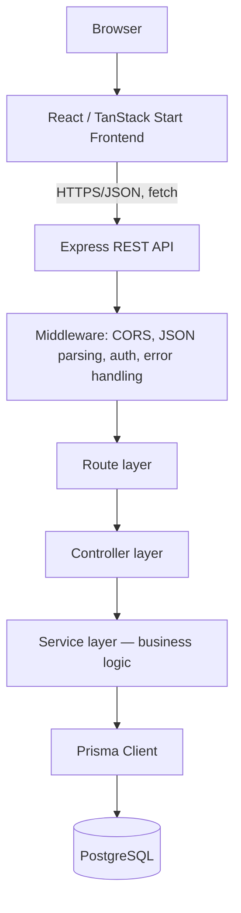
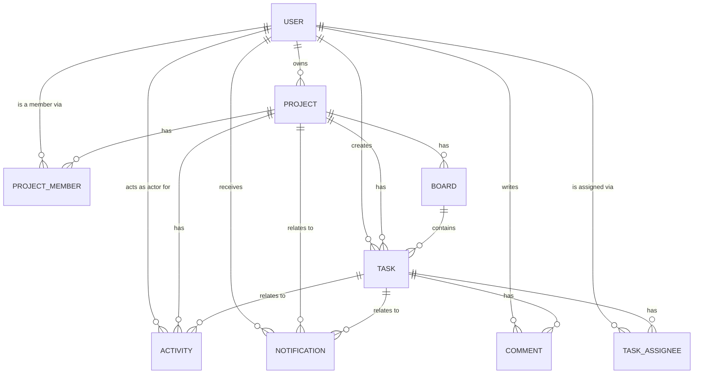
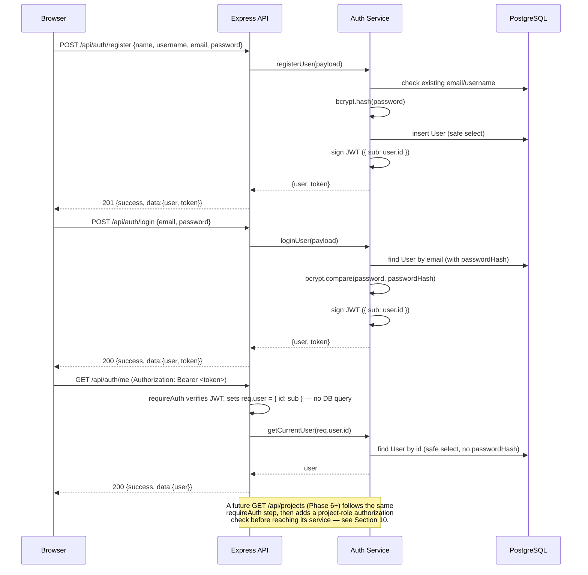
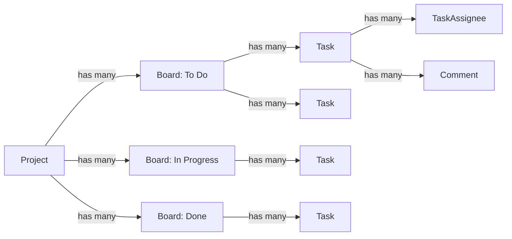
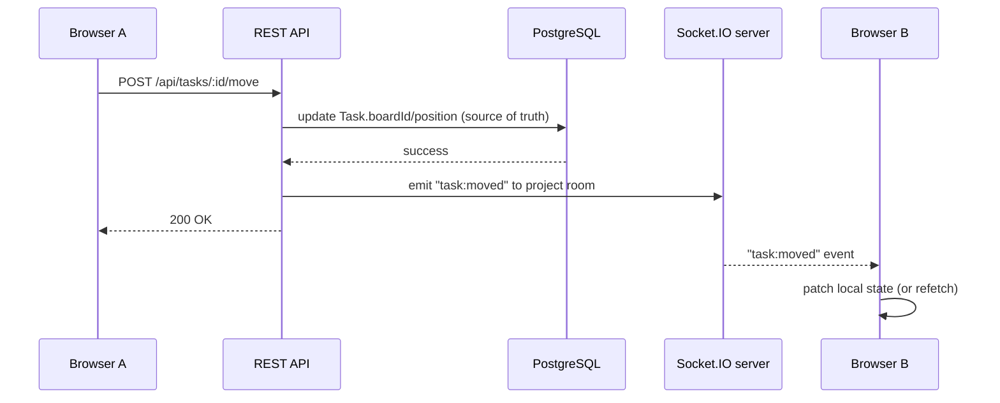

# TaskFlow — Architecture

CodeAlpha Full Stack Development Internship — Task 3

This document describes the planned and current architecture of TaskFlow, a
collaborative project-management application. It is written before
implementation begins (Phase 0) and is kept in sync as the project grows.

## 1. Project purpose

TaskFlow is a lightweight Trello/Asana-style project management tool. Users
create projects, invite members, organize work on boards, and track tasks
through comments, assignments, priorities, and due dates. It is built as a
portfolio-quality full-stack application, not a minimal CRUD demo.

## 2. CodeAlpha Task 3 requirements

The brief requires a project management tool supporting:

1. Users/authentication
2. Group projects
3. Project members
4. Task assignment
5. Task management
6. Comments/communication within tasks
7. Project boards
8. Task cards

Bonus scope: notifications and real-time updates. These core requirements
drive every schema and API decision below; bonus features are designed for,
but implemented last.

## 3. Functional scope

**In scope (current and future phases):**

- Registration, login, JWT-based sessions
- Profile management
- Creating projects and becoming a project owner
- Adding project members with roles (OWNER / ADMIN / MEMBER)
- Creating boards within a project
- Creating, moving, and prioritizing tasks
- Assigning tasks to one or more project members
- Commenting on tasks
- Project activity timeline
- Notifications (bonus)
- Real-time updates via Socket.IO (bonus)

**Out of scope:** deployment, third-party auth providers, file uploads,
mobile apps, external backend services (Supabase/Firebase/Mongo are
explicitly excluded — this project uses PostgreSQL + Prisma only).

## 4. Technology stack

| Layer | Technology |
|---|---|
| Frontend | React, TypeScript, TanStack Start, TanStack Router, Vite, Tailwind CSS |
| Backend | Node.js, Express.js (REST API), JavaScript |
| Database | PostgreSQL, Prisma ORM |
| Auth | JWT, bcryptjs |
| Real-time (bonus, later) | Socket.IO |
| Dev tooling | npm workspaces, Docker Compose (local Postgres only), Git |

## 5. High-level architecture



The service layer is the only layer allowed to call Prisma directly.
Controllers translate HTTP ↔ service calls; they never contain business
logic or raw queries. This keeps route handlers thin and testable and keeps
persistence details out of the HTTP layer.

## 6. Frontend architecture

- **TanStack Start + TanStack Router** for file-based routing and SSR-capable
  React rendering (mirrors the pattern already used in Task2).
- **Vite** as the dev server/bundler.
- **Tailwind CSS** for styling.
- Planned structure:
  - `src/routes/` — file-based routes (pages)
  - `src/components/` — reusable UI building blocks, later grouped by domain
    (project, board, task, comment, notification) as those features land
  - `src/lib/` — API client, auth context, formatting/date helpers
  - `src/hooks/` — reusable React hooks (data fetching, debouncing, etc.)
  - `src/styles/` — global Tailwind entry point
- The frontend never hardcodes application/demo data. All content is fetched
  from the REST API, which is in turn backed by the database seed system.
- State that must be shared across the app (current user/session) will live
  in a React context, following the `AuthContext` pattern from Task2.

## 7. Backend architecture

Layered Express application:

```
routes/      → maps HTTP verb + path to a controller function
controllers/ → parses req, calls a service, shapes the HTTP response
services/    → business logic, calls Prisma, enforces domain rules
validators/  → request payload validation (checked before controllers act)
middleware/  → cross-cutting concerns: CORS, auth, error handling, 404
config/      → environment loading, Prisma client singleton
utils/       → stateless helpers (password hashing, JWT signing, etc.)
```

`app.js` wires middleware and routers together; `server.js` is the only file
that binds a port and owns process lifecycle (including graceful shutdown).
This split allows the Express app to be imported by tests without starting a
real network listener.

## 8. Database architecture

PostgreSQL is the single source of truth for all application state,
accessed exclusively through Prisma Client from the service layer. See
[DATABASE_SCHEMA.md](./DATABASE_SCHEMA.md) for full model-by-model detail.



## 9. Authentication architecture

**Implemented in Phase 4.** Full detail — including the exact validation
rules, the login-timing consideration, and per-scenario security notes —
lives in [AUTHENTICATION.md](./AUTHENTICATION.md); this section stays at
the architectural level.

- Register: validate input (`server/src/validators/auth.validator.js`),
  bcrypt-hash the password (`bcryptjs`, cost factor 12 —
  `server/src/utils/password.js`), create a `User` row, return a signed JWT.
  A duplicate email/username is a `409`, resolved both by a pre-check and by
  catching Prisma's `P2002` on the insert (closing the race between the two).
- Login: look up by email (selecting `passwordHash` only for this one
  query), `bcrypt.compare`, return a signed JWT. A nonexistent email and a
  wrong password produce the exact same `401` — see
  [AUTHENTICATION.md](./AUTHENTICATION.md#login-flow) for why, including the
  dummy-hash timing consideration.
- JWT payload: `{ sub: userId }` plus the standard `iat`/`exp` — nothing
  else — signed with `JWT_SECRET`, expiring per `JWT_EXPIRES_IN`
  (`server/src/utils/jwt.js`).
- Token transport: `Authorization: Bearer <token>` header, checked by
  `requireAuth` (`server/src/middleware/auth.middleware.js`). This
  middleware establishes *authentication* only (the token's signature proves
  who the caller is) — it does not query the database; anything needing
  fresher user data or *authorization* looks it up itself from `req.user.id`.
- `passwordHash` is never selected into an API response. Two distinct Prisma
  `select` objects exist for this reason: one includes `passwordHash` for
  the login comparison only, the other never selects it at all (used by
  registration and `/me`) — the safe-vs-unsafe boundary is enforced at the
  query itself, not left to a serializer to remember.
- A dedicated `toSafeUser()` serializer (`server/src/utils/user.js`) allow-lists
  exactly the fields an API response may contain, used identically by
  register, login, and `/me` — never a raw spread of a Prisma row.



## 10. Authorization architecture (planned — later phase)

Not implemented yet — deliberately out of scope for Phase 4, which only
establishes *authentication* (proving who is calling). Authorization
(deciding what that caller is allowed to do) is a separate concern, built
once there's a resource worth restricting:

Role-based, scoped to a project via `ProjectMember.role`:

- **OWNER** — full control: rename/delete project, manage members and roles,
  transfer ownership.
- **ADMIN** — manage boards/tasks/members, cannot delete the project or
  remove the owner.
- **MEMBER** — create/update/move/comment on tasks, cannot manage membership.

The `requireAuth` middleware (Section 9, implemented) verifies the JWT and
attaches `req.user = { id }`. A separate `requireProjectRole(minRole)`
middleware (later phase) will run *after* `requireAuth`, load the caller's
`ProjectMember` row for the `:projectId` in the route, and reject with 403
if the role is insufficient. Ownership is always cross-checked against
`Project.ownerId`, not just `ProjectMember.role`, since the owner row is
authoritative.

## 11. Project membership model

- `Project.ownerId` is the single source of truth for who owns a project.
- Every project also has a corresponding `ProjectMember` row for its owner
  (`role = OWNER`), so membership listings/queries never need a special
  case for "is this the owner." Service-layer logic (later phase) is
  responsible for keeping these two facts in sync — e.g. creating that
  `ProjectMember` row transactionally when a `Project` is created.
- `(projectId, userId)` is a composite primary key on `ProjectMember`,
  guaranteeing a user cannot join the same project twice.

## 12. Board/task relationship

- A `Project` has many `Board`s (e.g. "To Do", "In Progress", "Review",
  "Done" — names are per-project data, not hardcoded enum values, so
  projects can define their own workflow).
- A `Board` has many `Task`s. A `Task` also carries its own `projectId` so
  project-scoped task queries never require a join through `Board` — this
  is intentional denormalization for query simplicity and safe indexing.
- `position` (integer) on both `Board` and `Task` gives deterministic,
  drag-and-drop-friendly ordering without reordering every row on every
  move (later phase can use fractional/gap-based positions if needed).



## 13. Task assignment model

- `TaskAssignee` is a join table between `Task` and `User`, with a composite
  primary key `(taskId, userId)` — a task can have zero or more assignees,
  and a user cannot be assigned to the same task twice.
- Later-phase business rule (enforced in the service layer, not the
  schema): an assignee must already be a `ProjectMember` of the task's
  project. Prisma cannot express this cross-table constraint declaratively,
  so it is validated before the `TaskAssignee` row is created.

## 14. Comment model

- A `Comment` belongs to exactly one `Task` and has exactly one `author`
  (`User`). Comments are the primary communication channel on a task.
- Comments are ordered by `createdAt` (indexed as `(taskId, createdAt)` for
  efficient "load a task's comment thread" queries).
- Editing a comment updates `updatedAt`; the API (later phase) can use this
  to show "edited" indicators.

## 15. Notification architecture (planned — later phase)

- A `Notification` always has a `userId` (recipient) and a `type`
  (`NotificationType` enum) plus a human-readable `message`.
- `projectId`/`taskId` are optional context pointers, cascading with their
  target so a notification never dangles after its subject is deleted.
- Notifications are created by the service layer as a side effect of
  domain actions (assigning a task, commenting, moving a task, adding a
  member) — never created directly by a controller.
- REST endpoints (later phase): list my notifications, mark one/all as read.

## 16. Socket.IO architecture (planned — later phase, bonus)

Real-time updates are additive, not a replacement for persistence. Every
state change is written to PostgreSQL first; Socket.IO only broadcasts that
a change happened so connected clients can refetch/patch their view.



Planned conventions:

- One Socket.IO namespace/room per `projectId`; clients join the room for
  every project they currently have open.
- Events are named `<entity>:<action>` (`task:created`, `task:moved`,
  `comment:added`, `member:added`, `notification:new`).
- The socket server never accepts writes — it is emit-only from the
  server's perspective. Clients always write through the REST API.
- Socket auth reuses the same JWT (passed during the handshake) rather than
  inventing a second auth mechanism.

## 17. API organization

REST, versioned implicitly under `/api` (no `/v1` yet — added later if a
breaking change is needed). Current + planned resource layout:

```
/api/health            GET                          — implemented (Phase 3)
/api/health/db         GET                          — implemented (Phase 3)
/api/auth              POST /register, POST /login, — implemented (Phase 4)
                       GET /me (requireAuth)
/api/users/me           GET, PATCH                  — planned (Phase 5, profile editing)
/api/projects           GET, POST
/api/projects/:id       GET, PATCH, DELETE
/api/projects/:id/members         GET, POST, PATCH, DELETE
/api/projects/:id/boards          GET, POST
/api/boards/:id                   PATCH, DELETE
/api/projects/:id/tasks            GET, POST
/api/tasks/:id                     GET, PATCH, DELETE
/api/tasks/:id/assignees           POST, DELETE
/api/tasks/:id/comments             GET, POST
/api/comments/:id                   PATCH, DELETE
/api/projects/:id/activity           GET
/api/notifications                   GET, PATCH
```

Each resource group gets its own `routes/*.routes.js`, mounted from a single
`routes/index.js`, matching the Task2 convention.

`/api/auth/me` and the planned `/api/users/me` are deliberately separate:
the former is read-only "who am I" identity data returned as part of the
auth module (Phase 4), the latter is full profile editing (Phase 5) —
merging them would make the auth module depend on profile business logic
it has no reason to know about.

## 18. Error-handling strategy

**Implemented in Phase 3.** A small `AppError` class
(`server/src/utils/AppError.js` — `message`, `statusCode`, `code`) is how
services/controllers signal a deliberate, expected failure (a dependency
that's down, a not-found record, a conflict). It is deliberately not a
framework: one class, no subclass hierarchy.

The centralized `errorHandler` middleware (`server/src/middleware/errorHandler.js`)
resolves any thrown value in this order:

1. `AppError` — trusted as-is (its whole point is a safe, chosen message).
2. Malformed JSON (`express.json()`'s `entity.parse.failed`) → 400.
3. Oversized body (`entity.too.large`) → 413.
4. Known Prisma errors — `PrismaClientKnownRequestError` `P2002` (unique
   conflict) → 409, `P2025` (record missing) → 404, anything else known →
   400; `PrismaClientValidationError` → 400.
5. A plain `Error` with an explicit non-500 `.status`/`.statusCode` (e.g. the
   health service's 503) — trusted, since deliberate application code set
   it. An explicit 500 is **not** trusted this way, only `AppError` may
   speak for a 500 — an ordinary bug can also happen to have
   `.statusCode === 500` sitting on it, and that must not leak its message.
6. Anything else → generic 500, `"Something went wrong"`. Full error detail
   (including stack) is logged server-side via `console.error` for every
   5xx, in every environment — but the response body never contains a
   stack trace, regardless of `NODE_ENV`.

Every error response has the same shape: `{ success: false, message, code? }`.
Every success response is `{ success: true, message }` (health endpoints) or
`{ success: true, data }` (future resource endpoints) — established now so
later controllers have one convention to follow.

Controllers never `try/catch` business errors themselves beyond passing them
to `next(error)` — and as of Express 5 (used here), an `async` route handler
that throws or rejects is forwarded to `next(error)` automatically, so no
`asyncHandler` wrapper is needed (verified directly against the installed
Express version; see Phase 3 verification notes in the project history).

A `notFoundHandler` catches any unmatched route under `/api` and returns
`{ success: false, message: "Route not found", code: "NOT_FOUND" }` — JSON,
never an HTML error page.

## 19. Validation strategy

- Request payloads are validated in a `validators/` layer before reaching
  controllers, checked as Express middleware on the relevant routes (later
  phase — Phase 1/2 only need the folder to exist as a foundation).
- Validation failures short-circuit with a 400 and a descriptive message;
  they never reach the service layer.
- Prisma's own schema constraints (unique, required, foreign key, enum) are
  the last line of defense, not the primary validation mechanism.

## 20. Security strategy

**Implemented in Phase 3:**

- `helmet()` sets the standard set of safe HTTP headers (`X-Content-Type-Options`,
  hides `X-Powered-By`, etc.). Its default cross-origin-resource-policy
  (`same-origin`) is deliberately relaxed to `cross-origin` — this API is
  designed to be called from a different origin/port (the Vite frontend),
  and the default would otherwise cause browsers to block the frontend's own
  legitimate `fetch()` calls even though CORS allows them. This is the one
  documented deviation from helmet's defaults, and it only affects who may
  *read a response*, not who may write one — it does not weaken CORS itself.
- CORS restricted to the exact string in `CLIENT_URL` (never `*`, never an
  origin-reflecting function) — a mismatched `Origin` still gets a response,
  but with an `Access-Control-Allow-Origin` that doesn't match its own
  origin, which is what makes browsers refuse to expose it to that page's
  JavaScript. `credentials` is intentionally left off, since nothing sends
  cookies yet — enabling it "just in case" would only widen what a
  misconfigured origin could do, for no current benefit.
- `express.json()` body size capped at 100kb — comfortably larger than any
  request this phase's endpoints take, small enough to make a trivial
  payload-flood pointless.
- Environment validation fails startup immediately in production if
  `DATABASE_URL`, `JWT_SECRET`, or `CLIENT_URL` is missing, rather than
  failing confusingly later on first use.
- Nothing is ever logged that could leak a secret: the dev-only request
  logger records method/path/status/duration only (never headers or body),
  and error logging never includes `DATABASE_URL`, `JWT_SECRET`, or request
  bodies.
- Postgres bound to `127.0.0.1` only in Docker Compose — never exposed on
  the network.
- `.env` files are git-ignored; only `.env.example` (placeholders) is
  committed.

**Implemented in Phase 4:**

- Passwords hashed with bcryptjs (cost 12); `passwordHash` is selected from
  the database only for the login comparison and is never serialized into
  any API response (enforced by two separate Prisma `select` shapes, plus
  an allow-list serializer — see Section 9).
- JWTs signed with `JWT_SECRET`, minimal payload (`sub` only), expire per
  `JWT_EXPIRES_IN`. Every failure mode of `requireAuth` (missing header,
  wrong scheme, empty/malformed/expired/tampered token, wrong signature)
  returns the identical generic `401` — none of them is distinguishable
  from the response.
- Login failure (nonexistent email vs. wrong password) is a single generic
  `401 "Invalid email or password"`, with a dummy bcrypt comparison run for
  a nonexistent email so response timing doesn't leak which case it was.
- Registration validation happens before any database or bcrypt work, and
  never reveals database internals in its error messages.

**Planned for later phases:**

- Authorization checks (project role, resource ownership) happen in the
  service layer, not just the UI, so the API is safe even if the frontend is
  bypassed. (Phase 4 established *authentication* only — see Section 10.)

## 21. Testing strategy

- **API verification:** manual `curl`/HTTP checks against `/api/health` and
  `/api/health/db`, plus the full Phase 3 foundation matrix — malformed
  JSON (400), oversized body (413), unknown route (404), allowed vs.
  arbitrary CORS origin, and a real database-down scenario (503, verified by
  stopping the Postgres container) — all confirmed against the running
  server. Automated request-level tests are added once there's enough
  surface area to justify a test runner as a dependency.
- **Phase 4 authentication verification:** the full register → login → `/me`
  sequence against real PostgreSQL; every validation rule (bad username
  shapes including the mixed-case case, bad email, short/over-length
  password, missing fields); duplicate email and duplicate username (409);
  wrong password and nonexistent email (both the identical generic 401);
  every `requireAuth` rejection path (no header, `Basic` scheme, empty
  `Bearer`, malformed token, tampered token, expired token, a token signed
  with a different secret); the decoded JWT payload (confirmed to contain
  only `sub`/`iat`/`exp`); a Phase 2 seed account logging in through the new
  endpoint with its original seed-time password hash; and a full regression
  of every Phase 3 behavior (health, 404, malformed JSON, oversized body,
  CORS). See [AUTHENTICATION.md](./AUTHENTICATION.md) for the complete
  scenario list and results.
- **Database verification:** `prisma migrate`, `prisma db seed`, and direct
  queries (via `prisma studio` or ad hoc scripts) confirm schema integrity
  and seed idempotency. Phase 4 required no schema change — the Phase 2
  `User` model already had everything authentication needs.
- **Build verification:** `npm run build` for both workspaces must succeed
  with zero TypeScript/bundler errors; `tsc --noEmit` confirms the client
  independently.
- Automated test suites (integration tests per resource) are planned for
  later phases once there are real endpoints worth testing.
- **Known limitation:** graceful shutdown was verified by code review (a
  guarded, standard `SIGINT`/`SIGTERM` handler — see Section 12/18), not by
  an interactive `Ctrl+C`. Delivering a real POSIX signal to a background
  Node process from this development environment isn't reliable enough to
  demonstrate one way or the other, so this is reported as a limitation
  rather than a false "tested" claim.

## 22. Development phases

- **Phase 0** — architecture & planning (this document).
- **Phase 1** — project scaffolding: monorepo, client foundation, server
  foundation, health endpoints, Docker Postgres.
- **Phase 2** — database layer: full Prisma schema, migrations, seed data.
- **Phase 3** — backend foundation: `AppError` + centralized error handling
  (malformed JSON, oversized body, Prisma errors), `helmet`, dev request
  logging, guarded graceful shutdown, consistent response envelope. No new
  resource routes — `/api` still only exposes `health` and `health/db`.
- **Phase 4** — authentication: registration, login, JWT issuance and
  verification (`requireAuth`), `GET /api/auth/me`, bcrypt password
  hashing, input validation, duplicate-account handling, safe user
  serialization. No schema change — the Phase 2 `User` model already had
  everything this needed. No authorization (project roles), no profile
  editing, no frontend auth UI — those remain later phases.
- **Phase 5+ (not started)** — user profile editing, projects/members API,
  boards/tasks API, comments API, notifications API, full frontend
  (dashboard, Kanban board, task detail view, login/register UI),
  Socket.IO real-time layer.

## 23. Data flow

Example: a user moves a task to a different board.

1. Browser sends `PATCH /api/tasks/:id/move` with the new `boardId`/`position`.
2. Express routes it to `tasks.controller.moveTask`.
3. The controller calls `taskService.moveTask(userId, taskId, payload)`.
4. The service verifies the caller is a member of the task's project,
   updates the `Task` row via Prisma, writes an `Activity` row
   (`TASK_MOVED`), and (later phase) creates `Notification` rows for
   relevant users and emits a Socket.IO event.
5. Prisma commits to PostgreSQL — the single source of truth.
6. The HTTP response returns the updated task; connected clients in the
   project's Socket.IO room receive a `task:moved` event and reconcile
   their local state.

## 24. Important design decisions

- **npm workspaces monorepo** (`client`, `server`) instead of separate
  repos — keeps the CodeAlpha submission self-contained and simplifies
  cross-cutting scripts (`db:seed`, `dev`, `build`).
- **Service layer owns Prisma** — controllers and routes never import
  `@prisma/client` directly, keeping persistence swappable in theory and
  business logic testable in isolation.
- **Authorship relations use `Restrict` on delete; membership/derived
  relations use `Cascade`.** A user who has authored a project, task, or
  comment cannot be deleted until that content is reassigned or removed —
  this prevents silent data loss. Purely relational rows that only make
  sense in the presence of the user (`ProjectMember`, `TaskAssignee`,
  `Notification`) cascade away automatically. See
  [DATABASE_SCHEMA.md](./DATABASE_SCHEMA.md#deletion-behavior) for the full
  per-model breakdown.
- **`Activity.taskId` is nullable with `SetNull`, while
  `Notification.taskId` cascades.** Activity is an audit/timeline log —
  entries should survive even if the task they reference is later deleted.
  Notifications are actionable pointers to a specific task; once that task
  is gone, the notification is meaningless and is removed with it.
- **Board names are per-project data, not a hardcoded enum** — different
  teams use different workflows (some want a "Blocked" column, some don't),
  so `Board.name` is a free-text field ordered by `position`.
- **Denormalized `projectId` on `Task`** (in addition to `boardId`) — most
  task queries are project-scoped ("all tasks in this project"), and
  requiring a join through every board to answer that would be needless
  overhead and complexity.
- **Socket.IO is additive only** — the real-time layer is deliberately
  deferred past Phase 2 and, when built, will never be the system of
  record; PostgreSQL always is.
- **`AppError` is trusted at 500, a bare `Error` with `.status`/`.statusCode`
  is not** — the error handler needs some way to tell "a service
  deliberately signaled this failure with a safe message" apart from "an
  unrelated bug happens to have a `.statusCode` property sitting on it."
  Requiring the explicit `AppError` type for that trust boundary at 500
  keeps an accidental property from ever leaking an internal error message,
  while still letting deliberate non-500 signals (like the health service's
  503) pass through without needing to be rewritten as `AppError`.
- **Helmet's cross-origin-resource-policy is relaxed to `cross-origin`,
  not left at its `same-origin` default** — this project's frontend and API
  intentionally run on different origins (separate Vite/Express ports),
  so the default would silently break every frontend `fetch()` call despite
  CORS explicitly allowing them. This is the one place Phase 3 deviates from
  a security library's default, and it's deviated from with an explicit,
  documented reason rather than by disabling helmet altogether.
- **No `asyncHandler` wrapper** — Express 5 (in use here) already forwards a
  rejected promise from an `async` route handler to `next(error)`
  automatically; adding a wrapper on top would just be the same behavior
  twice. Confirmed directly against the installed Express version rather
  than assumed from framework version numbers alone.
- **Username case is rejected, not silently coerced** — `auth.validator.js`
  checks the `^[a-z0-9_]{3,30}$` shape against the trimmed input *before*
  lowercasing it, so `UserName` is a `400`, not a silently-renamed
  `username`. The alternative (lowercase first, then validate) would let a
  user register believing their username is `UserName` while the database
  actually stores something else — a small but real trust violation for an
  identifier a user chose and expects to see reflected back to them.
- **`requireAuth` never queries the database** — a JWT's signature is
  already sufficient proof of identity; looking the user up on every
  authenticated request would be a write-nothing, read-only database hit on
  the hot path for no benefit *to authentication specifically*. Later
  authorization middleware (Section 10) will query the database — but that
  is answering a different question ("is this user allowed to do X"), not
  "who is this user."
- **Two Prisma `select` shapes for `User`, not one shape plus a filter** —
  the query that needs `passwordHash` (login) and the queries that must
  never see it (register's insert, `/me`) use two separately-declared
  `select` objects (`server/src/services/auth.service.js`). The safe/unsafe
  boundary is enforced at the database query itself; a single "select
  everything, then delete `passwordHash` before responding" approach has a
  failure mode this doesn't: forgetting the deletion.
- **A dummy bcrypt comparison on login for a nonexistent email** — without
  it, a real bcrypt compare only happens when the email exists, giving a
  timing difference an attacker could use to enumerate registered emails.
  The dummy hash is computed once per process (not per request) purely to
  keep that comparison's cost consistent — it is not, and is never used as,
  a real password.
