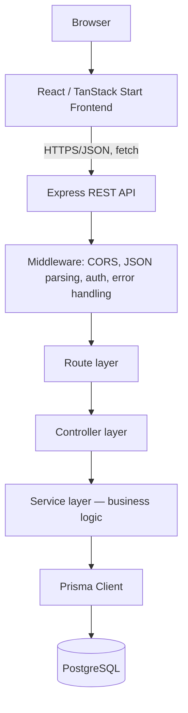
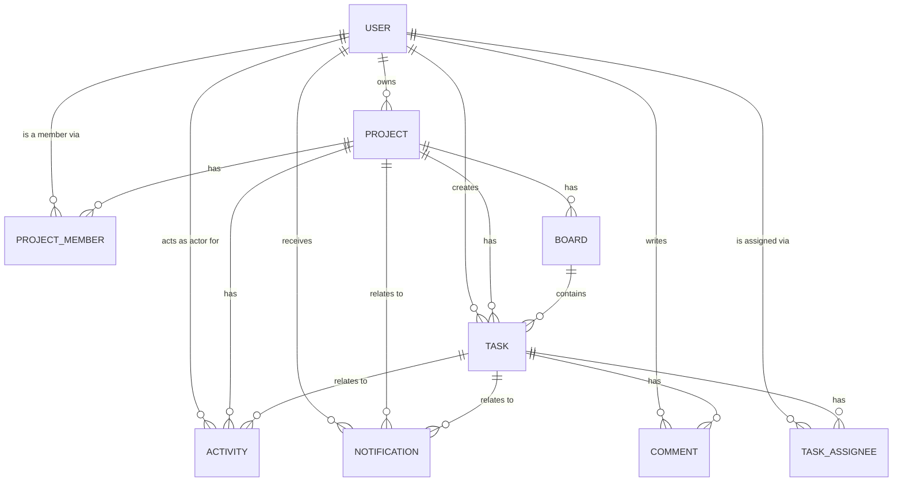
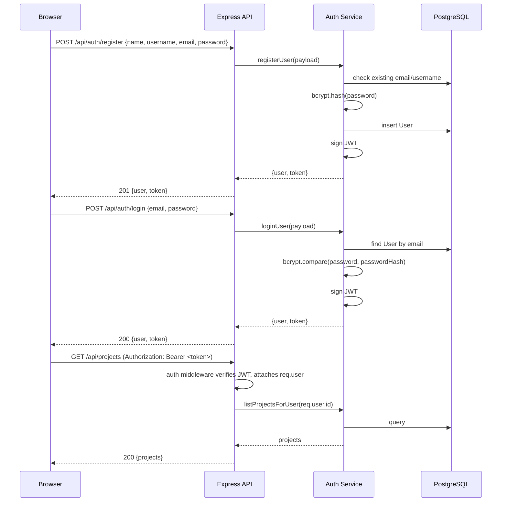
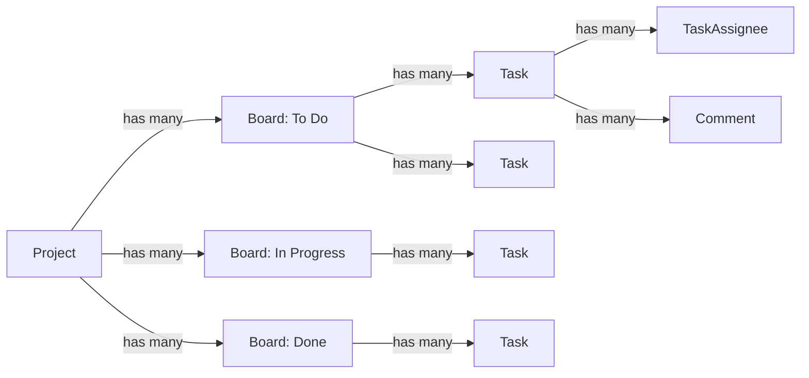
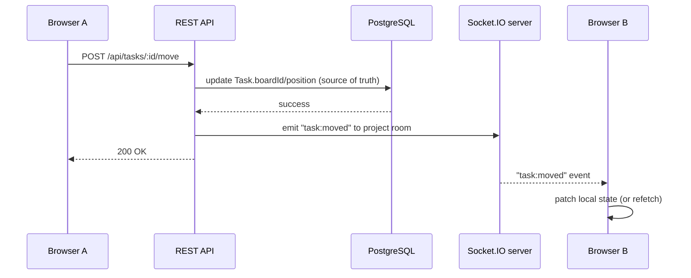

# TaskFlow — Architecture

CodeAlpha Full Stack Development Internship — Task 3

This document describes the planned and current architecture of TaskFlow, a
collaborative project-management application. It is written before
implementation begins (Phase 0) and is kept in sync as the project grows.

## 1. Project purpose

TaskFlow is a lightweight Trello/Asana-style project management tool. Users
create projects, invite members, organize work on boards, and track tasks
through comments, assignments, priorities, and due dates. It is built as a
portfolio-quality full-stack application, not a minimal CRUD demo.

## 2. CodeAlpha Task 3 requirements

The brief requires a project management tool supporting:

1. Users/authentication
2. Group projects
3. Project members
4. Task assignment
5. Task management
6. Comments/communication within tasks
7. Project boards
8. Task cards

Bonus scope: notifications and real-time updates. These core requirements
drive every schema and API decision below; bonus features are designed for,
but implemented last.

## 3. Functional scope

**In scope (current and future phases):**

- Registration, login, JWT-based sessions
- Profile management
- Creating projects and becoming a project owner
- Adding project members with roles (OWNER / ADMIN / MEMBER)
- Creating boards within a project
- Creating, moving, and prioritizing tasks
- Assigning tasks to one or more project members
- Commenting on tasks
- Project activity timeline
- Notifications (bonus)
- Real-time updates via Socket.IO (bonus)

**Out of scope:** deployment, third-party auth providers, file uploads,
mobile apps, external backend services (Supabase/Firebase/Mongo are
explicitly excluded — this project uses PostgreSQL + Prisma only).

## 4. Technology stack

| Layer | Technology |
|---|---|
| Frontend | React, TypeScript, TanStack Start, TanStack Router, Vite, Tailwind CSS |
| Backend | Node.js, Express.js (REST API), JavaScript |
| Database | PostgreSQL, Prisma ORM |
| Auth | JWT, bcryptjs |
| Real-time (bonus, later) | Socket.IO |
| Dev tooling | npm workspaces, Docker Compose (local Postgres only), Git |

## 5. High-level architecture



The service layer is the only layer allowed to call Prisma directly.
Controllers translate HTTP ↔ service calls; they never contain business
logic or raw queries. This keeps route handlers thin and testable and keeps
persistence details out of the HTTP layer.

## 6. Frontend architecture

- **TanStack Start + TanStack Router** for file-based routing and SSR-capable
  React rendering (mirrors the pattern already used in Task2).
- **Vite** as the dev server/bundler.
- **Tailwind CSS** for styling.
- Planned structure:
  - `src/routes/` — file-based routes (pages)
  - `src/components/` — reusable UI building blocks, later grouped by domain
    (project, board, task, comment, notification) as those features land
  - `src/lib/` — API client, auth context, formatting/date helpers
  - `src/hooks/` — reusable React hooks (data fetching, debouncing, etc.)
  - `src/styles/` — global Tailwind entry point
- The frontend never hardcodes application/demo data. All content is fetched
  from the REST API, which is in turn backed by the database seed system.
- State that must be shared across the app (current user/session) will live
  in a React context, following the `AuthContext` pattern from Task2.

## 7. Backend architecture

Layered Express application:

```
routes/      → maps HTTP verb + path to a controller function
controllers/ → parses req, calls a service, shapes the HTTP response
services/    → business logic, calls Prisma, enforces domain rules
validators/  → request payload validation (checked before controllers act)
middleware/  → cross-cutting concerns: CORS, auth, error handling, 404
config/      → environment loading, Prisma client singleton
utils/       → stateless helpers (password hashing, JWT signing, etc.)
```

`app.js` wires middleware and routers together; `server.js` is the only file
that binds a port and owns process lifecycle (including graceful shutdown).
This split allows the Express app to be imported by tests without starting a
real network listener.

## 8. Database architecture

PostgreSQL is the single source of truth for all application state,
accessed exclusively through Prisma Client from the service layer. See
[DATABASE_SCHEMA.md](./DATABASE_SCHEMA.md) for full model-by-model detail.



## 9. Authentication architecture (planned — later phase)

- Register: bcrypt-hash the password (`bcryptjs`, cost factor 10), create a
  `User` row, return a signed JWT.
- Login: verify credentials, return a signed JWT.
- JWT payload: `{ sub: userId }`, short-lived expiry (configurable via
  `JWT_EXPIRES_IN`), signed with `JWT_SECRET`.
- Token transport: `Authorization: Bearer <token>` header.
- `passwordHash` is never selected into API responses; Prisma queries that
  return a `User` will explicitly `select` safe fields only.



## 10. Authorization architecture (planned — later phase)

Role-based, scoped to a project via `ProjectMember.role`:

- **OWNER** — full control: rename/delete project, manage members and roles,
  transfer ownership.
- **ADMIN** — manage boards/tasks/members, cannot delete the project or
  remove the owner.
- **MEMBER** — create/update/move/comment on tasks, cannot manage membership.

An `auth` middleware will verify the JWT and attach `req.user`. A separate
`requireProjectRole(minRole)` middleware (later phase) will load the
caller's `ProjectMember` row for the `:projectId` in the route and reject
with 403 if the role is insufficient. Ownership is always cross-checked
against `Project.ownerId`, not just `ProjectMember.role`, since the owner
row is authoritative.

## 11. Project membership model

- `Project.ownerId` is the single source of truth for who owns a project.
- Every project also has a corresponding `ProjectMember` row for its owner
  (`role = OWNER`), so membership listings/queries never need a special
  case for "is this the owner." Service-layer logic (later phase) is
  responsible for keeping these two facts in sync — e.g. creating that
  `ProjectMember` row transactionally when a `Project` is created.
- `(projectId, userId)` is a composite primary key on `ProjectMember`,
  guaranteeing a user cannot join the same project twice.

## 12. Board/task relationship

- A `Project` has many `Board`s (e.g. "To Do", "In Progress", "Review",
  "Done" — names are per-project data, not hardcoded enum values, so
  projects can define their own workflow).
- A `Board` has many `Task`s. A `Task` also carries its own `projectId` so
  project-scoped task queries never require a join through `Board` — this
  is intentional denormalization for query simplicity and safe indexing.
- `position` (integer) on both `Board` and `Task` gives deterministic,
  drag-and-drop-friendly ordering without reordering every row on every
  move (later phase can use fractional/gap-based positions if needed).



## 13. Task assignment model

- `TaskAssignee` is a join table between `Task` and `User`, with a composite
  primary key `(taskId, userId)` — a task can have zero or more assignees,
  and a user cannot be assigned to the same task twice.
- Later-phase business rule (enforced in the service layer, not the
  schema): an assignee must already be a `ProjectMember` of the task's
  project. Prisma cannot express this cross-table constraint declaratively,
  so it is validated before the `TaskAssignee` row is created.

## 14. Comment model

- A `Comment` belongs to exactly one `Task` and has exactly one `author`
  (`User`). Comments are the primary communication channel on a task.
- Comments are ordered by `createdAt` (indexed as `(taskId, createdAt)` for
  efficient "load a task's comment thread" queries).
- Editing a comment updates `updatedAt`; the API (later phase) can use this
  to show "edited" indicators.

## 15. Notification architecture (planned — later phase)

- A `Notification` always has a `userId` (recipient) and a `type`
  (`NotificationType` enum) plus a human-readable `message`.
- `projectId`/`taskId` are optional context pointers, cascading with their
  target so a notification never dangles after its subject is deleted.
- Notifications are created by the service layer as a side effect of
  domain actions (assigning a task, commenting, moving a task, adding a
  member) — never created directly by a controller.
- REST endpoints (later phase): list my notifications, mark one/all as read.

## 16. Socket.IO architecture (planned — later phase, bonus)

Real-time updates are additive, not a replacement for persistence. Every
state change is written to PostgreSQL first; Socket.IO only broadcasts that
a change happened so connected clients can refetch/patch their view.



Planned conventions:

- One Socket.IO namespace/room per `projectId`; clients join the room for
  every project they currently have open.
- Events are named `<entity>:<action>` (`task:created`, `task:moved`,
  `comment:added`, `member:added`, `notification:new`).
- The socket server never accepts writes — it is emit-only from the
  server's perspective. Clients always write through the REST API.
- Socket auth reuses the same JWT (passed during the handshake) rather than
  inventing a second auth mechanism.

## 17. API organization

REST, versioned implicitly under `/api` (no `/v1` yet — added later if a
breaking change is needed). Planned resource layout for later phases:

```
/api/health            GET
/api/health/db         GET
/api/auth              POST /register, POST /login
/api/users/me           GET, PATCH
/api/projects           GET, POST
/api/projects/:id       GET, PATCH, DELETE
/api/projects/:id/members         GET, POST, PATCH, DELETE
/api/projects/:id/boards          GET, POST
/api/boards/:id                   PATCH, DELETE
/api/projects/:id/tasks            GET, POST
/api/tasks/:id                     GET, PATCH, DELETE
/api/tasks/:id/assignees           POST, DELETE
/api/tasks/:id/comments             GET, POST
/api/comments/:id                   PATCH, DELETE
/api/projects/:id/activity           GET
/api/notifications                   GET, PATCH
```

Each resource group gets its own `routes/*.routes.js`, mounted from a single
`routes/index.js`, matching the Task2 convention.

## 18. Error-handling strategy

- Services throw plain `Error` objects with a `.status` property for
  expected failures (not found, conflict, forbidden); unexpected errors
  bubble up as plain 500s.
- Controllers never `try/catch` business errors themselves beyond passing
  them to `next(error)` — a single centralized `errorHandler` middleware
  formats every error response as `{ success: false, message }`, logging
  full detail server-side only for 500s (never leaking internals to the
  client).
- A `notFoundHandler` catches any unmatched route under `/api` and returns a
  consistent 404 JSON body.

## 19. Validation strategy

- Request payloads are validated in a `validators/` layer before reaching
  controllers, checked as Express middleware on the relevant routes (later
  phase — Phase 1/2 only need the folder to exist as a foundation).
- Validation failures short-circuit with a 400 and a descriptive message;
  they never reach the service layer.
- Prisma's own schema constraints (unique, required, foreign key, enum) are
  the last line of defense, not the primary validation mechanism.

## 20. Security strategy

- Passwords hashed with bcryptjs; `passwordHash` is never serialized into
  an API response.
- JWTs signed with a server-only secret (`JWT_SECRET`), never stored in
  `localStorage` in a way that's exposed to arbitrary third-party scripts
  more than necessary — transport and storage details are finalized in the
  auth implementation phase.
- CORS restricted to `CLIENT_URL` (never `*`), so only the known frontend
  origin can call the API with credentials.
- Postgres bound to `127.0.0.1` only in Docker Compose — never exposed on
  the network.
- `express.json()` body size is capped to prevent trivial payload-based
  abuse.
- `.env` files are git-ignored; only `.env.example` (placeholders) is
  committed.
- Authorization checks (project role, resource ownership) happen in the
  service layer, not just the UI, so the API is safe even if the frontend
  is bypassed.

## 21. Testing strategy

- **API verification:** manual `curl`/HTTP checks against `/api/health` and
  `/api/health/db` in this phase; automated request-level tests are added
  once real endpoints exist.
- **Database verification:** `prisma migrate`, `prisma db seed`, and direct
  queries (via `prisma studio` or ad hoc scripts) confirm schema integrity
  and seed idempotency.
- **Build verification:** `npm run build` for both workspaces must succeed
  with zero TypeScript/bundler errors.
- Automated test suites (integration tests per resource) are planned for
  later phases once there are real endpoints worth testing.

## 22. Development phases

- **Phase 0** — architecture & planning (this document).
- **Phase 1** — project scaffolding: monorepo, client foundation, server
  foundation, health endpoints, Docker Postgres.
- **Phase 2** — database layer: full Prisma schema, migrations, seed data.
- **Phase 3+ (not started)** — authentication, projects/members API,
  boards/tasks API, comments API, notifications API, full frontend
  (dashboard, Kanban board, task detail view), Socket.IO real-time layer.

## 23. Data flow

Example: a user moves a task to a different board.

1. Browser sends `PATCH /api/tasks/:id/move` with the new `boardId`/`position`.
2. Express routes it to `tasks.controller.moveTask`.
3. The controller calls `taskService.moveTask(userId, taskId, payload)`.
4. The service verifies the caller is a member of the task's project,
   updates the `Task` row via Prisma, writes an `Activity` row
   (`TASK_MOVED`), and (later phase) creates `Notification` rows for
   relevant users and emits a Socket.IO event.
5. Prisma commits to PostgreSQL — the single source of truth.
6. The HTTP response returns the updated task; connected clients in the
   project's Socket.IO room receive a `task:moved` event and reconcile
   their local state.

## 24. Important design decisions

- **npm workspaces monorepo** (`client`, `server`) instead of separate
  repos — keeps the CodeAlpha submission self-contained and simplifies
  cross-cutting scripts (`db:seed`, `dev`, `build`).
- **Service layer owns Prisma** — controllers and routes never import
  `@prisma/client` directly, keeping persistence swappable in theory and
  business logic testable in isolation.
- **Authorship relations use `Restrict` on delete; membership/derived
  relations use `Cascade`.** A user who has authored a project, task, or
  comment cannot be deleted until that content is reassigned or removed —
  this prevents silent data loss. Purely relational rows that only make
  sense in the presence of the user (`ProjectMember`, `TaskAssignee`,
  `Notification`) cascade away automatically. See
  [DATABASE_SCHEMA.md](./DATABASE_SCHEMA.md#deletion-behavior) for the full
  per-model breakdown.
- **`Activity.taskId` is nullable with `SetNull`, while
  `Notification.taskId` cascades.** Activity is an audit/timeline log —
  entries should survive even if the task they reference is later deleted.
  Notifications are actionable pointers to a specific task; once that task
  is gone, the notification is meaningless and is removed with it.
- **Board names are per-project data, not a hardcoded enum** — different
  teams use different workflows (some want a "Blocked" column, some don't),
  so `Board.name` is a free-text field ordered by `position`.
- **Denormalized `projectId` on `Task`** (in addition to `boardId`) — most
  task queries are project-scoped ("all tasks in this project"), and
  requiring a join through every board to answer that would be needless
  overhead and complexity.
- **Socket.IO is additive only** — the real-time layer is deliberately
  deferred past Phase 2 and, when built, will never be the system of
  record; PostgreSQL always is.
