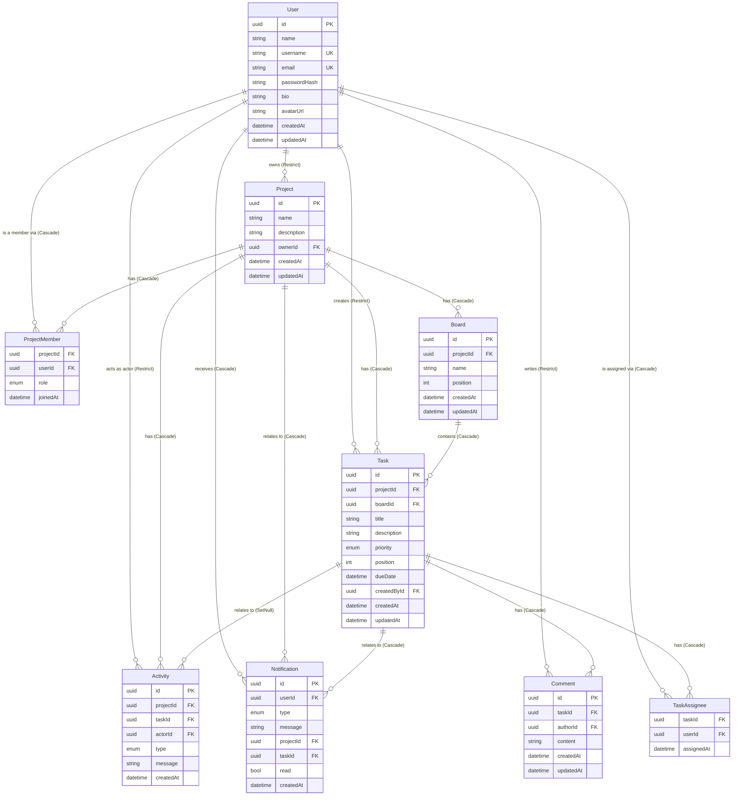

# TaskFlow — Database Schema

This document explains the Prisma/PostgreSQL schema in
[`server/prisma/schema.prisma`](../server/prisma/schema.prisma): every model,
its important fields, relationships, indexes, constraints, enums, and
deletion behavior.

## Entity relationship diagram

## Models

### User

The account/profile record. `passwordHash` is stored with bcrypt and is
never selected into API responses (enforced later at the service layer via
explicit Prisma `select`s).

| Field | Type | Notes |
|---|---|---|
| `id` | `uuid` | PK, `@default(uuid())` |
| `name` | `string` | display name |
| `username` | `string` | **unique**, max 30 chars |
| `email` | `string` | **unique** |
| `passwordHash` | `string` | bcrypt hash, never exposed |
| `bio` | `string?` | optional |
| `avatarUrl` | `string?` | optional |
| `createdAt` / `updatedAt` | `datetime` | timestamps |

Unique constraints on `email` and `username` double as their lookup
indexes — no separate index needed.

### Project

| Field | Type | Notes |
|---|---|---|
| `id` | `uuid` | PK |
| `name` | `string` | required |
| `description` | `string?` | optional |
| `ownerId` | `uuid` | FK → `User.id`, `onDelete: Restrict` |
| `createdAt` / `updatedAt` | `datetime` | timestamps |

`ownerId` is the single authoritative pointer to who owns the project. A
project is also expected to have a `ProjectMember` row for its owner
(`role = OWNER`) so member listings never special-case ownership — this
invariant is enforced by the service layer, not the schema, since Prisma
cannot express "insert this row whenever that row is inserted" declaratively.

Index: `@@index([ownerId])`.

### ProjectMember

Join table between `User` and `Project`, carrying a role.

| Field | Type | Notes |
|---|---|---|
| `projectId` | `uuid` | FK → `Project.id`, `onDelete: Cascade` |
| `userId` | `uuid` | FK → `User.id`, `onDelete: Cascade` |
| `role` | `ProjectRole` | `OWNER \| ADMIN \| MEMBER`, default `MEMBER` |
| `joinedAt` | `datetime` | default `now()` |

Composite primary key `@@id([projectId, userId])` — a user can only be a
member of a given project once; this also serves as the lookup index for
"is user X a member of project Y."

Index: `@@index([userId])` (for "all projects a user belongs to").

### Board

| Field | Type | Notes |
|---|---|---|
| `id` | `uuid` | PK |
| `projectId` | `uuid` | FK → `Project.id`, `onDelete: Cascade` |
| `name` | `string` | free text, e.g. "To Do" — per-project, not an enum |
| `position` | `int` | deterministic ordering within a project |
| `createdAt` / `updatedAt` | `datetime` | timestamps |

Indexes: `@@index([projectId])`, `@@index([projectId, position])` (fast
"boards for this project, in order").

### Task

| Field | Type | Notes |
|---|---|---|
| `id` | `uuid` | PK |
| `projectId` | `uuid` | FK → `Project.id`, `onDelete: Cascade` (denormalized for project-scoped queries) |
| `boardId` | `uuid` | FK → `Board.id`, `onDelete: Cascade` |
| `title` | `string` | required |
| `description` | `string?` | optional, `@db.Text` |
| `priority` | `TaskPriority` | `LOW \| MEDIUM \| HIGH \| URGENT`, default `MEDIUM` |
| `position` | `int` | ordering within a board |
| `dueDate` | `datetime?` | optional |
| `createdById` | `uuid` | FK → `User.id`, `onDelete: Restrict` |
| `createdAt` / `updatedAt` | `datetime` | timestamps |

Indexes: `@@index([projectId])`, `@@index([boardId])`,
`@@index([createdById])`, `@@index([createdAt])`, `@@index([dueDate])`.

Both `projectId` and `boardId` cascade from their respective parents. In
PostgreSQL this is safe even though a `Task` is reachable from `Project`
both directly and indirectly (through `Board`) — unlike SQL Server,
PostgreSQL does not reject multiple cascade paths to the same table.

### TaskAssignee

Join table between `Task` and `User` — a task can have zero or more
assignees.

| Field | Type | Notes |
|---|---|---|
| `taskId` | `uuid` | FK → `Task.id`, `onDelete: Cascade` |
| `userId` | `uuid` | FK → `User.id`, `onDelete: Cascade` |
| `assignedAt` | `datetime` | default `now()` |

Composite primary key `@@id([taskId, userId])` prevents duplicate
assignments and serves as the primary lookup index.

Index: `@@index([userId])` (for "all tasks assigned to this user").

Business rule enforced later in the service layer, not the schema: an
assignee must already be a `ProjectMember` of the task's project.

### Comment

| Field | Type | Notes |
|---|---|---|
| `id` | `uuid` | PK |
| `taskId` | `uuid` | FK → `Task.id`, `onDelete: Cascade` |
| `authorId` | `uuid` | FK → `User.id`, `onDelete: Restrict` |
| `content` | `string` | `@db.Text` |
| `createdAt` / `updatedAt` | `datetime` | timestamps |

Indexes: `@@index([taskId])`, `@@index([authorId])`,
`@@index([taskId, createdAt])` (fast "comment thread for a task, in order").

### Notification

| Field | Type | Notes |
|---|---|---|
| `id` | `uuid` | PK |
| `userId` | `uuid` | FK → `User.id`, `onDelete: Cascade` — recipient |
| `type` | `NotificationType` | see enum below |
| `message` | `string` | human-readable |
| `projectId` | `uuid?` | FK → `Project.id`, `onDelete: Cascade`, optional context |
| `taskId` | `uuid?` | FK → `Task.id`, `onDelete: Cascade`, optional context |
| `read` | `bool` | default `false` |
| `createdAt` | `datetime` | default `now()` |

Indexes: `@@index([userId])`, `@@index([read])`,
`@@index([userId, read])` (fast "unread notifications for this user"),
`@@index([createdAt])`.

`NotificationType` enum: `TASK_ASSIGNED`, `TASK_COMMENTED`, `TASK_UPDATED`,
`TASK_MOVED`, `PROJECT_MEMBER_ADDED`, `PROJECT_INVITE`.

### Activity

Project timeline/audit log.

| Field | Type | Notes |
|---|---|---|
| `id` | `uuid` | PK |
| `projectId` | `uuid` | FK → `Project.id`, `onDelete: Cascade` |
| `taskId` | `uuid?` | FK → `Task.id`, `onDelete: SetNull`, optional |
| `actorId` | `uuid` | FK → `User.id`, `onDelete: Restrict` |
| `type` | `ActivityType` | see enum below |
| `message` | `string` | human-readable |
| `createdAt` | `datetime` | default `now()` |

Indexes: `@@index([projectId])`, `@@index([projectId, createdAt])` (fast
"timeline for this project"), `@@index([taskId])`, `@@index([actorId])`.

`ActivityType` enum: `PROJECT_CREATED`, `MEMBER_ADDED`, `TASK_CREATED`,
`TASK_UPDATED`, `TASK_MOVED`, `TASK_ASSIGNED`, `COMMENT_ADDED`.

## Deletion behavior

Deleting a **Project** cascades to:

- `ProjectMember` rows (direct `Cascade`)
- `Board` rows (direct `Cascade`)
- `Task` rows (direct `Cascade`, which in turn cascades to that task's own
  `TaskAssignee` and `Comment` rows, and nulls out `Activity.taskId`)
- `Notification` rows referencing the project (direct `Cascade`)
- `Activity` rows for the project (direct `Cascade`)

Deleting a **Task** cascades to its `TaskAssignee` and `Comment` rows and
its own `Notification` rows, but only nulls out `taskId` on `Activity` rows
(the project timeline entry survives, e.g. "Task 'Fix bug' was created,"
even after the task itself is gone).

Deleting a **User** is intentionally restricted wherever the user is an
**author** of persistent content — `Project.ownerId`, `Task.createdById`,
`Comment.authorId`, `Activity.actorId` all use `onDelete: Restrict`. The
database will refuse to delete a user until that content is reassigned or
removed, preventing silent data loss. Purely relational/derived rows —
`ProjectMember`, `TaskAssignee`, `Notification` — cascade away automatically
since they only make sense in the presence of that user. **A `Project`
deletion never deletes a `User`** — the foreign key points the other
direction, so this is structurally impossible, not just a policy choice.

## Constraints and integrity

- No duplicate emails/usernames: `@unique` on `User.email` and
  `User.username`.
- No duplicate project membership: composite PK on
  `ProjectMember(projectId, userId)`.
- No duplicate task assignment: composite PK on
  `TaskAssignee(taskId, userId)`.
- No orphaned boards/tasks/comments/assignments: every child row's parent
  FK is `NOT NULL` and cascades from its parent (except the intentionally
  nullable `Activity.taskId` and `Notification.projectId`/`taskId`, which
  are optional context pointers by design).
- No invalid enum values: `ProjectRole`, `TaskPriority`, `NotificationType`,
  and `ActivityType` are native Postgres enums via Prisma — the database
  rejects any value outside the declared set.
- The seed script (`server/prisma/seed.js`) uses deterministic UUIDs and
  `upsert` so re-running it never creates duplicate rows.
